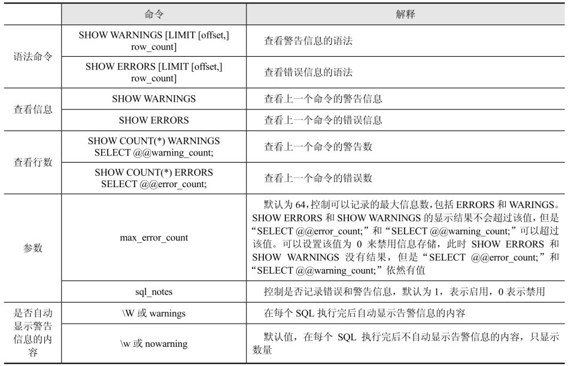
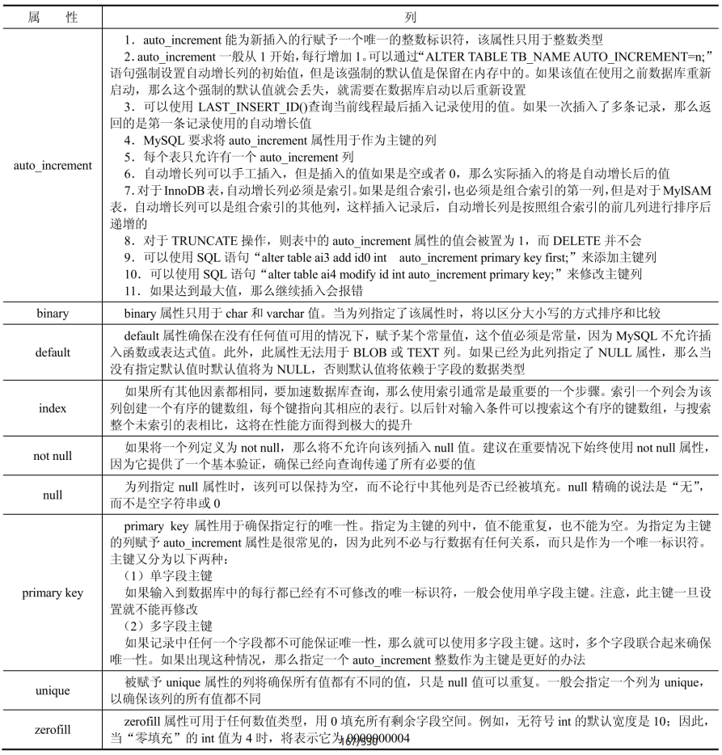

# MySQL 基础操作

- [MySQL 基础操作](#mysql-基础操作)
  - [创建和删除数据库](#创建和删除数据库)
  - [获取表内所有列的名称和类型/表结构](#获取表内所有列的名称和类型表结构)
  - [增删查改](#增删查改)
    - [创建表](#创建表)
    - [删除表](#删除表)
    - [清空表](#清空表)
    - [插入](#插入)
    - [查询](#查询)
    - [修改](#修改)
    - [不存在则插入，存在则更新](#不存在则插入存在则更新)
    - [创建 B 表，完整复制 A 表的结构和索引，而且不要数据](#创建-b-表完整复制-a-表的结构和索引而且不要数据)
    - [查看某一用户的权限](#查看某一用户的权限)
    - [当前 BINARY LOG 文件和 POSITION 值](#当前-binary-log-文件和-position-值)
    - [切换 BINARY LOG](#切换-binary-log)
    - [整理表数据文件的碎片](#整理表数据文件的碎片)
    - [得到TA_LHR表的建表语句](#得到ta_lhr表的建表语句)
    - [修改命令提示符](#修改命令提示符)
    - [MySQL 中的 pager 命令的作用](#mysql-中的-pager-命令的作用)
    - [SHOW WARNINGS 和 SHOW ERRORS 的作用](#show-warnings-和-show-errors-的作用)
    - [快速地复制一张表及其数据](#快速地复制一张表及其数据)
    - [MySQL 中的 IFNULL() 的作用](#mysql-中的-ifnull-的作用)
    - [](#)
    - [在表的指定位置添加列](#在表的指定位置添加列)
    - [删除列](#删除列)
    - [复杂查询](#复杂查询)
  - [查询数据库的用户](#查询数据库的用户)
  - [查看创建的索引及索引类型等信息](#查看创建的索引及索引类型等信息)
  - [查看数据库的版本、当前登录用户和当前的数据库名称](#查看数据库的版本当前登录用户和当前的数据库名称)
  - [常用日期和时间函数](#常用日期和时间函数)
    - [dayofweek()](#dayofweek)
    - [dayofyear()](#dayofyear)
    - [hour/minute/second()](#hourminutesecond)
    - [date_format()](#date_format)
    - [str_to_date()](#str_to_date)
    - [curdate()/current_date](#curdatecurrent_date)
    - [curtime()/current_time](#curtimecurrent_time)
    - [now()/sysdate()/current_timestamp](#nowsysdatecurrent_timestamp)
    - [sec_to_time()](#sec_to_time)
    - [time_to_sec()](#time_to_sec)
  - [MySQL 数据类型](#mysql-数据类型)
    - [数值类型](#数值类型)
    - [日期和时间类型](#日期和时间类型)
    - [字符串类型](#字符串类型)
  - [MySQL 数据类型的属性](#mysql-数据类型的属性)
  - [MySQL 中运算符 “<=>” 的作用](#mysql-中运算符--的作用)
  - [MySQL中 IIMIT 的作用](#mysql中-iimit-的作用)
  - [对一张表同时进行查询和更新](#对一张表同时进行查询和更新)
  - [MySQL 中 LENGTH 和 CHAR LENGTH 的区别](#mysql-中-length-和-char-length-的区别)
  - [函数FROM_UNIXTIME和UNIX_TIMESTAMP的作用](#函数from_unixtime和unix_timestamp的作用)

## 创建和删除数据库

```sql
create database mysql_test character set utf8;

create database mysql_test character set gbk;

drop database mysql_test;
```

## 获取表内所有列的名称和类型/表结构

```sql
desc user;
```

显示指定表所有列的详细信息（通过该命令显示的都是建表时的信息）：

```sql
show full columns from user;
```

- Field：字段名。
- Type：该字段类型。
- Collation：描述了如何对查询出来的数据进行比较和排序。
- Null：是否允许为空，NO 表示不允许，YES 表示允许。
- Key：键，表示该列是否有索引，例如：主键（PRI），唯一键（UNI），非唯一键或多列唯一键（MUL）等。如果该列为空，那么表示该列没有索引或该列作为多列索引的非第1列。若表中没有主键，但是某个列创建了唯一索引，且不能包含空值，则该列会显示为PRI。若某个列含有多个键，则会按照优先级显示：PRI>UNI>MUL。
- Default：该字段默认值。
- Extra：附加信息，如自增主键上的（auto_increment）。
- Privileges：权限，有 select、update 等。
- Comment：字段注释。

```sql
show create table tablename
```

## 增删查改

### 创建表

```sql
create table `test`
(
    `id`   int(4)      not null,
    `name` varchar(20) not null
) engine = innodb
  default charset = gbk;

desc test;
```

### 删除表

```sql
drop table table_name;
```

### 清空表

```sql
truncate table table_name;
```

### 插入

```sql
-- 一条
insert into test(id, name)
values (1, 'newlhr');

select * from test;

-- 多条
insert into test(id, name)
values (2, 'hello'),
       (3, 'world');
```

### 查询

```sql
select *
from test
where name = 'newlhr';

select *
from test
where id > 1;
```

### 修改

```sql
update test
set name='oldhr'
where id = 1;
```

### 不存在则插入，存在则更新

在 Oracle 中有 MERGE INTO 来实现记录已存在就更新的操作，MySQL 没有 MERGE INTO 语法，但是有 REPLACE INTO 的写法，同样实现记录已存在就更新的操作。

MySQL 的 REPLACE INTO 有3种形式：

1. REPLACE INTO TBL_NAME(COL_NAME) VALUES(/)
2. REPLACE INTO TBL_NAME(COL_NAME) SELECT/
3. REPLACE INTO TBL_NAME SET COL_NAME=VALUE/

其中，“INTO” 关键字可以省略，不过最好加上 “INTO”，这样意思更加直观。另外，对于那些没有给予值的列，MySQL 将自动为这些列赋上默认值。

```sql

```

### 创建 B 表，完整复制 A 表的结构和索引，而且不要数据

```sql
CREATE TABLE b LIKE a;
```

### 查看某一用户的权限

```sql
SHOW GRANTS FOR USERNAME;
```

### 当前 BINARY LOG 文件和 POSITION 值

```sql
SHOW MASTER STATUS;
```

### 切换 BINARY LOG

```sql
FLUSH LOGS;
```

### 整理表数据文件的碎片

```sql
OPTIMIZE TABLE TABLENAME;
```

### 得到TA_LHR表的建表语句

```sql
SHOW CREATE TABLE TA_LHR;
```

### 修改命令提示符

全局：export MYSQL_PS1="(\u@\h) [\d]>"

当前会话：prompt (\u@\h) [\d]\R:\m:\s>\_

其中，“\u”代表用户名，“\h”代表服务器地址，“\d”代表当前数据库，“\R:\m:\s”代表时分秒，例如：23:10:10。

### MySQL 中的 pager 命令的作用

在 MySQL 日常操作中，妙用 pager 设置显示方式，可以大大提高工作效率。例如，SELECT 查询出来的结果集显示面积超过几个屏幕，那么前面的结果将一晃而过无法看到，这时候可以使用 pager 命令设置调用 os 的 more 或者 less 等显示查询结果，和在 os 中使用 more 或者 less 查看大文件的效果一样。

nopager 命令可以取消 pager 设置，恢复之前的输出状态。

### SHOW WARNINGS 和 SHOW ERRORS 的作用

SHOW WARNINGS 可以显示上一个命令的警告信息，SHOW ERRORS 可以显示上一个命令的错误信息。



### 快速地复制一张表及其数据

可以使用like关键字，但是like只复制了表结构及其索引，而其数据没有复制，所以，需要使用insert来插入。

```sql
insert into vote_record
select *
from vote_record_memory;
```

### MySQL 中的 IFNULL() 的作用

使用 IFNULL() 方法能使 MySQL 中的查询更加精确。IFNULL() 方法将会测试它的第一个参数，若不为 NULL 则返回该参数的值，否则返回第二个参数的值。

```sql
select vote_id, ifnull(vote_id, 'unknown') as `id`
from vote_record;
```
### 

### 在表的指定位置添加列

```sql
-- 在字段 name 前插入 age 字段，类型 tinyint(4)
alter table test
    add `age` tinyint(4) not null default 0 after id;
```

### 删除列

```sql
alter table test drop column age;
```

### 复杂查询

```sql
create table `t1`
(
    `id`    double,
    `name`  varchar(300),
    `score` double
);

insert into `t1`(`id`, `name`, `score`)
values ('1', 'N1', '59'),
       ('2', 'N2', '54'),
       ('3', 'N3', '87'),
       ('4', 'N4', '67'),
       ('5', 'N5', '97'),
       ('6', 'N1', '56'),
       ('7', 'N2', '98'),
       ('8', 'N3', '76'),
       ('9', 'N4', '45'),
       ('10', 'N5', '89');
```

1. 查询单分数最高的人和单分数最低的人

```sql
-- 查询最大值和最小值
select max(score)
from t1
union all
select min(score)
from t1;

select *
from t1
where score in (select max(score) from t1 union all select min(score) from t1);
```

2. 查询两门分数加起来的第2至5名

```sql
select name, sum(score)
from t1
group by name
order by sum(score) desc
limit 1,4;
```

3. 查询两门总分数在150分以下的人

```sql
select name, sum(score)
from t1
group by name
having sum(score) < 150;
```

4. 查询两门平均分数介于60和80的人

```sql
select name, avg(score)
from t1
group by name
having avg(score) between 60 and 80;
```

1. 查询总分大于150分，平均分小于90分的人

```sql
select name, sum(score), avg(score)
from t1
group by name
having sum(score) > 150
   and avg(score) < 90;
```

6. 查询总分大于150分，平均分小于90分的人有几个

```sql
select distinct count(*)
from t1
group by name
having sum(score) > 150
   and avg(score) < 90;
```

## 查询数据库的用户

可以通过查询 mysql.user 表来查询数据库的用户。

```sql
select distinct concat('user: ''', user, '''@''', host, ''':') as query
from mysql.user;

select user, host
from mysql.user;
```

## 查看创建的索引及索引类型等信息

```sql
show index from tableName;
```

## 查看数据库的版本、当前登录用户和当前的数据库名称

```sql
select version(), @@version, user(), database();
```

```shell
mysql -V
```

## 常用日期和时间函数

MySQL中日期转换为字符串使用DATE_FORMAT函数，相当于Oracle中的TO_CHAR函数，而将字符串转换为日期格式，使用的函数为STR_TO_DATE，相当于Oracle中的TO_DATE函数。

### dayofweek()

返回当天的星期索引，星期日索引为 1。

```sql
select dayofweek('2020-1-2');
```

### dayofyear()

返回当天是一年中的第几天。

```sql
select dayofyear('2020-2-3');
```

### hour/minute/second()

返回时间的小时值/分钟值/秒值。

```sql
select hour('10:04:23'), minute('10:04:23'), second('10:04:23');
```

### date_format()

格式化时间，常见。

```sql
select date_format('2019-03-23', '%W %M %Y');

select date_format('2019-03-23', '%d %m %y');
```

### str_to_date()

将字符串转换为日期类型。

```sql
select str_to_date('04/30/2019', '%m/%d/%Y');
```

### curdate()/current_date

以 2020-10-23 格式返回当前的日期值。

```sql
select curdate(), current_date;
```

### curtime()/current_time

以 20:23:34 格式返回当前时间值。

```sql
select curtime(), current_time;
```

### now()/sysdate()/current_timestamp

以 2020-12-12 12:12:12 格式返回当前日期时间。

```sql
select now(), sysdate(), current_timestamp;
```

### sec_to_time()

秒转换时分秒。

```sql
select sec_to_time(2378);
```

### time_to_sec()

时分秒转换秒。

```sql
select time_to_sec('12:23:12');
```

## MySQL 数据类型

MySQL 支持多种类型，大致可以分为三类：数值、日期/时间和字符串（字符）类型。

### 数值类型


### 日期和时间类型

表示时间值的日期和时间类型为DATETIME、DATE、TIMESTAMP、TIME和YEAR。每个时间类型有一个有效值范围和一个“零”值，当指定不合法的MySQL不能表示的值时使用“零”值。


使用日期类型需要注意如下几点内容：

1. 如果要记录年月日时分秒，并且记录的年份比较久远，那么最好使用DATETIME，而不要使用TIMESTAMP，因为TIMESTAMP表示的日期范围比DATETIME要短得多。

2. 如果记录的日期需要让不同时区的用户使用，那么最好使用TIMESTAMP，因为日期类型中只有它能够和实际时区相对应。

### 字符串类型

字符串类型指CHAR、VARCHAR、BINARY、VARBINARY、BLOB、TEXT、ENUM和SET。


字符类型需要注意如下几点内容：

1. CHAR和VARCHAR类型类似，但它们保存和检索的方式不同。它们的最大长度和尾部空格是否被保留等方面也不同。在存储或检索过程中不进行大小写转换。CHAR列的长度固定为创建表时声明的长度。长度可以为从0～255的任何值。当保存CHAR值时，在它们的右边填充空格以达到指定的长度。当检索到CHAR值时，尾部的空格被删除掉。在存储或检索过程中不进行大小写转换。VARCHAR列中的值为可变长字符串。长度可以指定为0～65535之间的值。VARCHAR的最大有效长度由最大行大小和使用的字符集确定。CHAR和VARCHAR类型声明的长度表示保存的最大字符数。例如，CHAR(30)可以占用30个字符。对于MyISAM表，推荐CHAR类型；对于InnoDB表，推荐VARCHAR类型。另外，在进行检索的时候，若列值的尾部含有空格，则CHAR列会删除其尾部的空格，而VARCHAR则会保留空格。

2. BINARY和VARBINARY类似于CHAR和VARCHAR，不同的是它们包含二进制字符串而不要非二进制字符串。也就是说，它们包含字节字符串而不是字符字符串。这说明它们没有字符集，并且排序和比较基于列值字节的数值。

3. BLOB是一个二进制大对象，可以容纳可变数量的数据。有4种BLOB类型：TINYBLOB、BLOB、MEDIUMBLOB和LONGBLOB。它们的区别只是可容纳值的最大长度不同。

4. 有4种TEXT类型：TINYTEXT、TEXT、MEDIUMTEXT和LONGTEXT。这些对应4种BLOB类型，有相同的最大长度和存储需求。

## MySQL 数据类型的属性

数据类型的属性包括 auto_increment、binary、default、index、not null、null、primary key、unique 和 zerofill。




## MySQL 中运算符 “<=>” 的作用

比较运算符“<=>”表示安全的等于，这个运算符和“=”类似，都执行相同的比较操作，不过“<=>”可以用来判断NULL值，在两个操作数均为NULL时，其返回值为1而不为NULL，而当一个操作数为NULL时，其返回值为0而不为NULL。


## MySQL中 IIMIT 的作用

限制返回结果行数，用于查询之后要显示返回的前几条或者中间某几行数据，其写法如下所示：

```shell
#从起始角标为0的位置，往后获取100条记录，也可简写为 LIMIT 100;
LIMIT 0,100;
```

```shell
#从起始角标为10的位置，往后获取6条记录。
LIMIT 10,6;
```

可以直接使用 limit 来进行分页操作，但这个关键字在数据量和偏移量（offset）比较大时，却很低效。所以，对 limit 优化，要么限制分页的数量，要么降低偏移量（offset）的大小。一般解决方法是关联查询或子查询优化法，可以先查询出主键，然后利用主键进行关联查询。优化示例如下：

```sql
-- 原 SQL：
select *
from vote_record
limit 10000, 100;

-- 优化 SQL：
select *
from vote_record
where id >= (select id from vote_record order by id limit 10000,1)
limit 100;
```

“LIMIT 100000,100”的效率更低。在语句“LIMIT 100000,100”中，实际上MySQL扫描了100100行记录，然后只返回100条记录，将前面的100000条记录抛弃掉。

MySQL的“limit m,n”工作原理就是先读取前m条记录，然后抛弃前m条，再读取n条想要的记录，所以m越大，性能会越差。优化思路是，在索引上完成排序分页的操作，最后根据主键关联回原表查询所需要的其他列内容。

```sql
select *
from vote_record
         inner join (select user_id
                     from vote_record
                     order by id
                     limit 10000,100) as vrui using (user_id);
```

区别在于，优化前的SQL需要更多I/O浪费，因为先读索引，再读数据，然后抛弃无用的行，而优化后的SQL只读索引就可以了，然后通过 ID 读取需要的列。

## 对一张表同时进行查询和更新

MySQL 不允许对同一张表同时进行查询和更新，可以使用临时表的方式来处理。

##  MySQL 中 LENGTH 和 CHAR LENGTH 的区别

LENGTH和CHAR_LENGTH是MySQL中获取字符串长度的两个函数。函数LENGTH是计算字段的长度，单位为字节，1个汉字算3个字节，1个数字或字母算1个字节。CHAR_LENGTH(str)返回值为字符串str的长度，单位为字符。CHARACTER_LENGTH()是CHAR_LENGTH()的同义词。对于函数CHAR_LENGTH来说，一个多字节字符算作一个单字符。Latin1字符的这两个函数返回结果是相同的，但是对于Unicode和其他编码来说，它们是不同的。例如，对于一个包含5个2字节字符集的字符串来说，LENGTH()返回值为10，而CHAR_LENGTH()的返回值为5。

##  函数FROM_UNIXTIME和UNIX_TIMESTAMP的作用

函数FROM_UNIXTIME将MySQL中用10位数字存储的时间以日期格式来显示。

语法：FROM_UNIXTIME(unix_timestamp,format)

函数UNIX_TIMESTAMP返回指定时间的UNIX格式数字串，即UNIX时间戳（从UTC时间'1970-01-01 00:00:00'开始的秒数），通常为十位，如1344887103。

语法：UNIX_TIMESTAMP( date )

参数：date可能是个DATE字符串，DATETIME字符串，TIMESTAPE字符串，或者是一个类似于YYMMDD或者YYYYMMDD的数字串。

返回：从UTC时间'1970-01-01 00:00:00'开始到该参数之间的秒数。服务器将参数date转化成UTC格式的内部时间。客户端则可以自行设置当前时区。当UNIX_TIMESTAMP()用于1个TIMESTAMP列时，函数直接返回内部时间戳的值；如果传递1个超出范围的时间到UNIX_TIMESTAMP()，它的返回值是零。如果date为空，那么将返回从UTC时间'1970-01-01 00:00:00'开始到当前时间的秒数。
