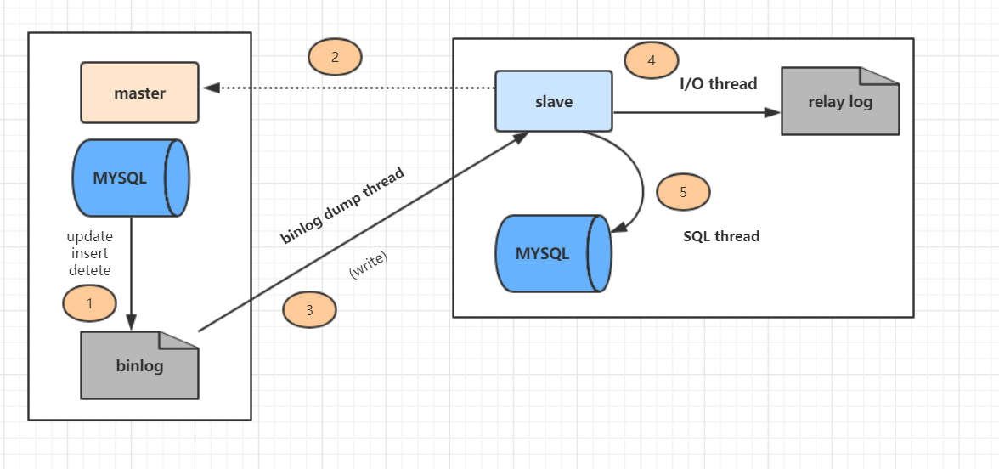

## 主从复制原理以及流程

主从复制分了五个步骤进行：

- 步骤一：主库的更新事件(update、insert、delete)被写到 binlog
- 步骤二：从库发起连接，连接到主库
- 步骤三：此时主库创建一个 binlog dump thread，把 binlog 的内容发送到从库
- 步骤四：从库启动之后，创建一个 I/O 线程，读取主库传过来的 binlog 内容并写入到 relay log
- 步骤五：还会创建一个 SQL 线程，从 relay log 里面读取内容，从 Exec_Master_Log_Pos 位置开始执行读取到的更新事件，将更新内容写入到 slave 的 db



### binlog 的三种录入格式

- statement，每一条修改数据的 sql 都会记录。不需要记录每一行的变化，减少了 binlog 日志量，节约了 IO，提高性能。由于 sql 的执行是有上下文的，因此在保存的时候需要保存相关的信息，同时还有一些使用了函数之类的语句无法被记录复制。
- row，不记录 sql 语句上下文相关信息，仅**保存哪条记录被修改**。记录单元为每一行的改动，基本是可以全部记下来但是由于很多操作，会导致大量行的改动，因此这种模式的文件保存的信息太多，日志量太大。
- mixed，一种折中的方案，普通操作使用 statement 记录，当无法使用 statement 的时候使用 row。

## 读写分离常见方案

应用程序根据业务逻辑来判断，增删改等写操作命令发给主库，查询命令发给备库。

利用中间件来做代理，负责对数据库的请求识别出读还是写，并分发到不同的数据库中。

## 主从延迟解决方案

### 主从同步延迟的原因

一个服务器开放Ｎ个链接给客户端来连接的，这样有会有大并发的更新操作, 但是从服务器的里面读取binlog的线程仅有一个，当某个SQL在从服务器上执行的时间稍长 或者由于某个SQL要进行锁表就会导致，主服务器的SQL大量积压，未被同步到从服务器里。这就导致了主从不一致， 也就是主从延迟。

### 主从同步延迟的解决办法

- 主服务器要负责更新操作，对安全性的要求比从服务器要高，所以有些设置参数可以修改，比如sync_binlog=1，innodb_flush_log_at_trx_commit = 1 之类的设置等。
- 选择更好的硬件设备作为slave。
- 把一台从服务器当度作为备份使用， 而不提供查询， 那边他的负载下来了， 执行relay log 里面的SQL效率自然就高了。
- 增加从服务器喽，这个目的还是分散读的压力，从而降低服务器负载。

```bash

```
