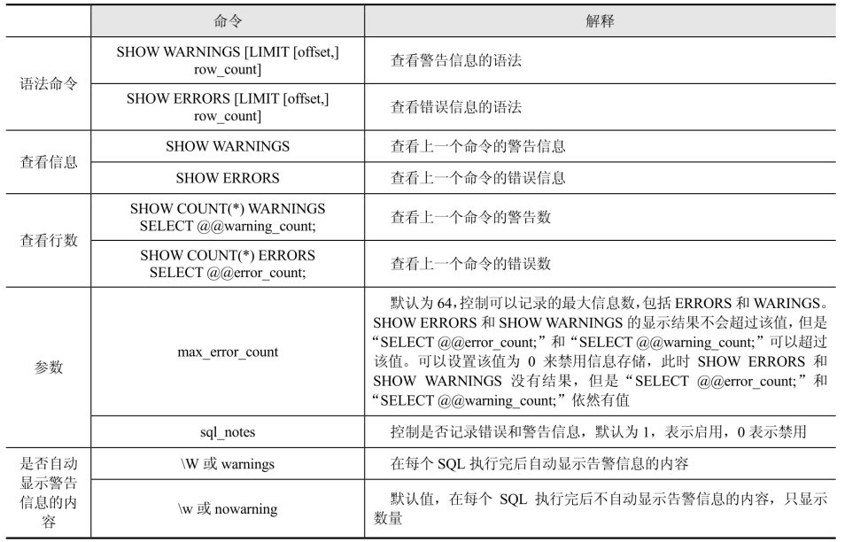
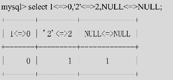

## 当前 BINARY LOG 文件和 POSITION 值

```sql
SHOW MASTER STATUS;
```

## 切换 BINARY LOG

```sql
FLUSH LOGS;
```

## 整理表数据文件的碎片

```sql
OPTIMIZE TABLE TABLENAME;
```

## 修改命令提示符

全局：export MYSQL_PS1="(\u@\h) [\d]>"

当前会话：prompt (\u@\h) [\d]\R:\m:\s>\_

其中，“\u”代表用户名，“\h”代表服务器地址，“\d”代表当前数据库，“\R:\m:\s”代表时分秒，例如：23:10:10。

## MySQL 中的 pager 命令的作用

在 MySQL 日常操作中，妙用 pager 设置显示方式，可以大大提高工作效率。例如，SELECT 查询出来的结果集显示面积超过几个屏幕，那么前面的结果将一晃而过无法看到，这时候可以使用 pager 命令设置调用 os 的 more 或者 less 等显示查询结果，和在 os 中使用 more 或者 less 查看大文件的效果一样。

nopager 命令可以取消 pager 设置，恢复之前的输出状态。

## SHOW WARNINGS 和 SHOW ERRORS 的作用

SHOW WARNINGS 可以显示上一个命令的警告信息，SHOW ERRORS 可以显示上一个命令的错误信息。



## 查看创建的索引及索引类型等信息

```sql
show index from tableName;
```

## MySQL 中运算符 “<=>” 的作用

比较运算符“<=>”表示安全的等于，这个运算符和“=”类似，都执行相同的比较操作，不过“<=>”可以用来判断NULL值，在两个操作数均为NULL时，其返回值为1而不为NULL，而当一个操作数为NULL时，其返回值为0而不为NULL。



## MySQL中 IIMIT 的作用

限制返回结果行数，用于查询之后要显示返回的前几条或者中间某几行数据，其写法如下所示：

```shell
#从起始角标为0的位置，往后获取100条记录，也可简写为 LIMIT 100;
LIMIT 0,100;
```

```shell
#从起始角标为10的位置，往后获取6条记录。
LIMIT 10,6;
```

可以直接使用 limit 来进行分页操作，但这个关键字在数据量和偏移量（offset）比较大时，却很低效。所以，对 limit 优化，要么限制分页的数量，要么降低偏移量（offset）的大小。一般解决方法是关联查询或子查询优化法，可以先查询出主键，然后利用主键进行关联查询。优化示例如下：

```sql
-- 原 SQL：
select *
from vote_record
limit 10000, 100;

-- 优化 SQL：
select *
from vote_record
where id >= (select id from vote_record order by id limit 10000,1)
limit 100;
```

“LIMIT 100000,100”的效率更低。在语句“LIMIT 100000,100”中，实际上MySQL扫描了100100行记录，然后只返回100条记录，将前面的100000条记录抛弃掉。

MySQL的“limit m,n”工作原理就是先读取前m条记录，然后抛弃前m条，再读取n条想要的记录，所以m越大，性能会越差。优化思路是，在索引上完成排序分页的操作，最后根据主键关联回原表查询所需要的其他列内容。

```sql
select *
from vote_record
         inner join (select user_id
                     from vote_record
                     order by id
                     limit 10000,100) as vrui using (user_id);
```

区别在于，优化前的SQL需要更多I/O浪费，因为先读索引，再读数据，然后抛弃无用的行，而优化后的SQL只读索引就可以了，然后通过 ID 读取需要的列。

