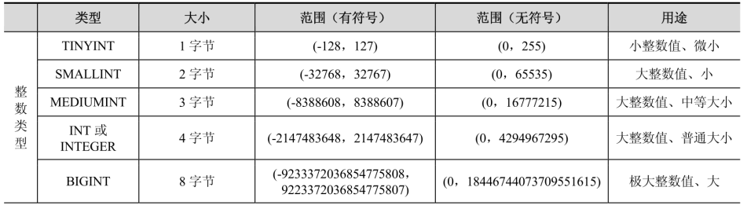
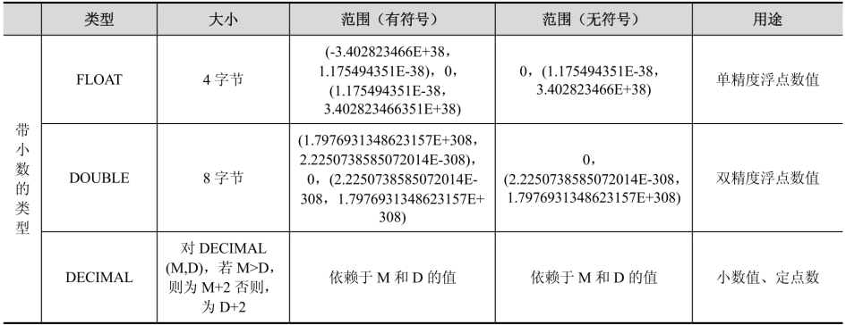
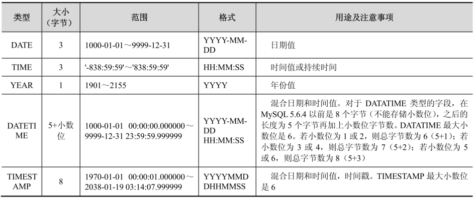
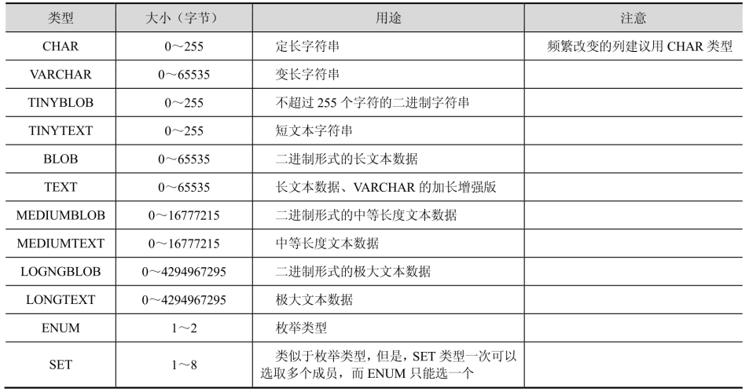
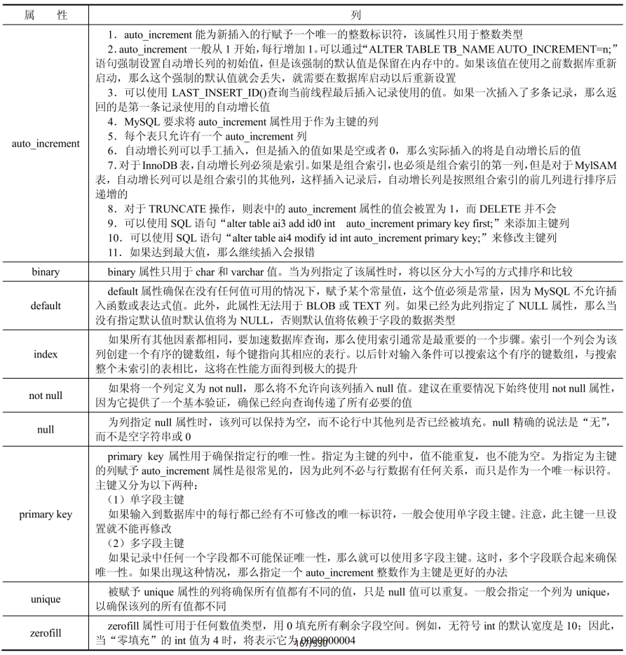

MySQL 支持多种类型，大致可以分为三类：数值、日期/时间和字符类型。

## 数值类型





## 日期和时间类型

表示时间值的日期和时间类型为 DATETIME、DATE、TIMESTAMP、TIME 和 YEAR。每个时间类型有一个有效值范围和一个“零”值，当指定不合法的 MySQL 不能表示的值时使用“零”值。



使用日期类型需要注意如下几点内容：

1. 如果要记录年月日时分秒，并且记录的年份比较久远，那么最好使用 DATETIME，而不要使用 TIMESTAMP，因为 TIMESTAMP 表示的日期范围比 DATETIME 要短得多。

2. 如果记录的日期需要让不同时区的用户使用，那么最好使用 TIMESTAMP，因为日期类型中只有它能够和实际时区相对应。

## 字符串类型

字符串类型指 CHAR、VARCHAR、BINARY、VARBINARY、BLOB、TEXT、ENUM 和 SET。



字符类型需要注意如下几点内容：

1. CHAR 和 VARCHAR 类型类似，但它们保存和检索的方式不同。它们的最大长度和尾部空格是否被保留等方面也不同。在存储或检索过程中不进行大小写转换。CHAR 列的长度固定为创建表时声明的长度。长度可以为从 0～255 的任何值。当保存 CHAR 值时，在它们的右边填充空格以达到指定的长度。当检索到 CHAR 值时，尾部的空格被删除掉。在存储或检索过程中不进行大小写转换。VARCHAR 列中的值为可变长字符串。长度可以指定为 0～65535 之间的值。VARCHAR 的最大有效长度由最大行大小和使用的字符集确定。CHAR 和 VARCHAR 类型声明的长度表示保存的最大字符数。例如，CHAR(30) 可以占用 30 个字符。对于 MyISAM 表，推荐 CHAR 类型；对于 InnoDB 表，推荐 VARCHAR 类型。另外，在进行检索的时候，若列值的尾部含有空格，则 CHAR 列会删除其尾部的空格，而 VARCHAR 则会保留空格。

2. BINARY 和 VARBINARY 类似于 CHAR 和 VARCHAR，不同的是它们包含二进制字符串而不要非二进制字符串。也就是说，它们包含字节字符串而不是字符字符串。这说明它们没有字符集，并且排序和比较基于列值字节的数值。

3. BLOB 是一个二进制大对象，可以容纳可变数量的数据。有 4 种 BLOB 类型：TINYBLOB、BLOB、MEDIUMBLOB 和 LONGBLOB。它们的区别只是可容纳值的最大长度不同。

4. 有 4 种 TEXT 类型：TINYTEXT、TEXT、MEDIUMTEXT 和 LONGTEXT。这些对应 4 种 BLOB 类型，有相同的最大长度和存储需求。

## 数据类型的属性

数据类型的属性包括 auto_increment、binary、default、index、not null、null、primary key、unique 和 zerofill。



## 隐式类型转换

当对不同类型的值进行比较的时候，为了使得这些数值可比较（也可以称为类型的兼容性），MySQL 会做一些隐式类型转化（Implicit type conversion）。

```sql
SELECT 1+'2';

SELECT CONCAT(1,'2');
```

很明显，在上面的 SQL 语句的执行过程中就出现了隐式转化。并且从结果可以判断出，在第一条 SQL 中，将字符串的“1”转换为数字 1，而在第二条的 SQL 中，将数字 2 转换为字符串“2”。

MySQL 也提供了 CAST() 函数，可以使用它明确地把数值转换为字符串。当使用 CONCAT() 函数的时候，也可能会出现隐式转化，因为它希望的参数为字符串形式，但是如果传递的不是字符串的话，那么它会发生隐式类型转换：

```sql
SELECT 38.8, CAST(38.8 AS CHAR), CONCAT(38.8);
```

隐式类型转换的规则为：

1. 当两个参数至少有一个是 NULL 时，比较的结果也是 NULL。若使用 `<=>` 对两个 NULL 做比较时则会返回 1。这两种情况都不需要做类型转换。

2. 当两个参数都是字符串时，会按照字符串来比较，不做类型转换。

3. 当两个参数都是整数时，按照整数来比较，不做类型转换。

4. 当十六进制的值和非数字做比较时，会被当作二进制串。

5. 当有一个参数是 TIMESTAMP 或 DATETIME，并且另外一个参数是常量时，常量会被转换为 TIMESTAMP。

6. 当有一个参数是 decimal 类型时，如果另外一个参数是 decimal 或者整数，那么会将整数转换为 decimal 后进行比较，如果另外一个参数是浮点数，那么会把 decimal 转换为浮点数进行比较。

7. 所有其他情况下，两个参数都会被转换为浮点数再进行比较。

```sql

```

```sql

```
