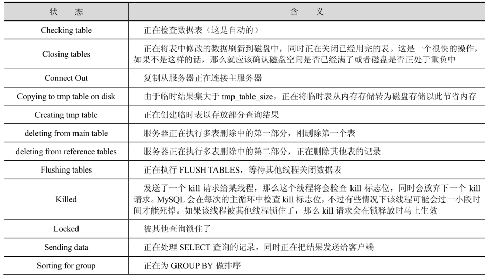
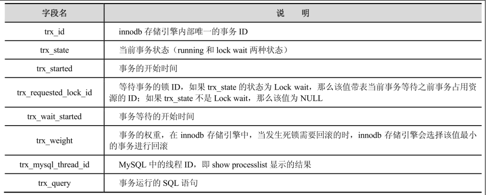
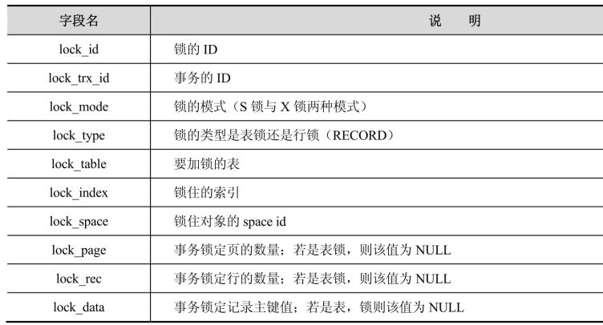
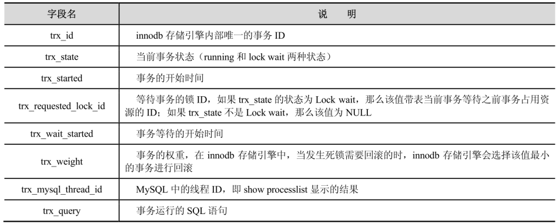

## 查询数据库的用户

可以通过查询 mysql.user 表来查询数据库的用户。

```sql
select distinct concat('user: ''', user, '''@''', host, ''':') as query
from mysql.user;

select user, host
from mysql.user;
```

## 查看某一用户的权限

```sql
SHOW GRANTS FOR USERNAME;
```

## 管理 MySQL 多实例

MySQL 多实例是指在一台机器上开启多个不同的服务端口（例如：3306、3307等），运行多个 MySQL 服务进程，通过不同的 Socket 监听不同的服务端口来提供各自的服务。

一般有两种方式来部署 MySQL 多实例：第一种是使用多个配置文件启动不同的进程来实现多实例，这种方式的优势是逻辑简单、配置简单，缺点是管理起来不太方便；第二种是通过官方自带的 mysqld_multi 使用单独的配置文件来实现多实例，这种方式定制每个实例的配置不太方面，优点是管理起来很方便，可以集中管理。

mysqld_multi 常用的命令如下所示：

- 启动全部实例：mysqld_multi start。
- 查看全部实例状态：mysqld_multi report。
- 启动单个实例：mysqld_multi start 3306。
- 停止单个实例：mysqld_multi stop 3306。
- 查看单个实例状态：mysqld_multi report 3306。

## 间隙（Next-Key）锁

当使用范围条件而不是相等条件检索数据的时候，并请求共享或排它锁时，InnoDB 会给符合条件的已有数据记录的索引项加锁；对于键值在条件范围内但并不存在的记录，称为“间隙（GAP）”，InnoDB 也会对这个“间隙”加锁，这种锁机制就是所谓的间隙（Next-Key）锁。

间隙锁是 InnoDB 中行锁的一种，但是这种锁锁住的不止一行数据，它锁住的是多行，是一个数据范围。间隙锁的主要作用是为了防止出现幻读（Phantom Read），用在 Repeated-Read（简称RR）隔离级别下。在 Read-Commited（简称RC）下，一般没有间隙锁（有外键情况下例外，此处不考虑）。间隙锁还用于恢复和复制。

间隙锁的出现主要集中在同一个事务中先 DELETE 后 INSERT 的情况下，当通过一个条件删除一条记录的时候，如果条件在数据库中已经存在，那么这个时候产生的是普通行锁，即锁住这个记录，然后删除，最后释放锁。如果这条记录不存在，那么问题就来了，数据库会扫描索引，发现这个记录不存在，这个时候的 DELETE 语句获取到的就是一个间隙锁，然后数据库会向左扫描，扫到第一个比给定参数小的值，向右扫描，扫描到第一个比给定参数大的值，然后以此为界，构建一个区间，锁住整个区间内的数据，一个特别容易出现死锁的间隙锁诞生了。

在 MySQL 的 InnoDB 存储引擎中，如果更新操作是针对一个区间的，那么它会锁住这个区间内所有的记录，例如 UPDATE XXX WHERE ID BETWEEN A AND B，那么它会锁住A到B之间所有记录，注意是所有记录，甚至如果这个记录并不存在也会被锁住，在这个时候，如果另外一个连接需要插入一条记录到A与B之间，那么它就必须等到上一个事务结束。典型的例子就是使用 AUTO_INCREMENT ID，由于这个ID是一直往上分配的，因此，当两个事务都 INSERT 时，会得到两个不同的 ID，但是这两条记录还没有被提交，因此，也就不存在，如果这个时候有一个事务进行范围操作，而且恰好要锁住不存在的 ID，就是触发间隙锁问题。所以，MySQL 中尽量不要使用区间更新。InnoDB 除了通过范围条件加锁时使用间隙锁外，如果使用相等条件请求给一个不存在的记录加锁，那么 InnoDB 也会使用间隙锁！

间隙锁也存在副作用，它会把锁定范围扩大，有时候也会带来麻烦。如果要关闭，那么一是将会话隔离级别改到 RC 下，或者开启 innodb_locks_unsafe_for_binlog（默认是OFF）。间隙锁只会出现在辅助索引上，唯一索引和主键索引是没有间隙锁。间隙锁（无论是S还是X）只会阻塞 INSERT 操作。

在 MySQL 数据库参数中，控制间隙锁的参数是 innodb_locks_unsafe_for_binlog，这个参数的默认值是 OFF，也就是启用间隙锁，它是一个布尔值，当值为 TRUE 时，表示 DISABLE 间隙锁。

## 用于查看锁的命令

### show processlist

“show processlist;” 可以显示哪些线程正在运行。如果当前用户有 SUPER 权限，那么就可以看到所有线程。如果有线程正在 UPDATE 或者 INSERT 某个表，那么进程的 status 为 updating 或者 sending data。“show processlist;” 只列出前100条数据，如果想列出所有结果，那么可以使用“show full processlist;”。

其中，Id 表示连接 id，可以使用 connection_id() 获取；Time 表示当前命令持续的时间，单位为秒；State 表示当前命令的操作状态，下面是一些常见的状态（State）：




### show open tables

这条命令能够查看当前有哪些表是打开的。in_use 列表示有多少线程正在使用某张表，name_locked 表示该表是否被锁，一般发生在使用 DROP 或 RENAME 命令操作这张表时。所以这条命令不能查询到当前某张表是否有死锁，谁拥有表上的这个锁等信息。

```sql
-- 给数据表上锁
lock tables sql_test.vote_record write;

show open tables from sql_test;

show open tables where In_use > 0;

-- 解锁数据表
unlock tables;
```

### show engine innodb status

查询 InnoDB 存储引擎的运行时信息，包括死锁的详细信息。

```sql
show engine innodb status;
```



### 查看服务器的状态

```sql
show status like '%lock%';
```

### 查询 information_schema 用户下的表

通过 information_shcema 下的 innodb_locks、innodb_lock_waits 和 innodb_trx 这三张表可以更新监控当前事务并且分析存在锁的问题。

查看当前状态产生的 InnoDB 锁，仅在有锁等待时有结果输出：

```sql
select *
from information_schema.INNODB_LOCKS;
```

表结构：



查看当前状态产生的 InnoDB 锁等待，仅在有锁等待时有结果输出：

```sql
select *
from information_schema.INNODB_LOCK_WAITS;
```

表结构：


当前 InnoDB 内核中的当前活跃（active）事务：

```sql
select *
from information_schema.INNODB_TRX;
```

表结构：



可以根据这三张表进行联合查询，得到更直观更清晰的结果。

### 在 MySQL 中查询 OS 线程 id（LWP）

从 MySQL 5.7 开始，在 performance_schema.threads 中加了一列 THREAD_OS_ID，可以通过该列匹配到 OS 线程 id（LWP）。

## MySQL 中 SQL Mode 的作用

SQL Mode（模式）定义了 MySQL 应支持的 SQL 语法、数据校验等，这样可以更容易地在不同的环境中使用 MySQL。SQL Mode 常用来解决下面几类问题：

1. 通过设置 SQL Mode，可以完成不同严格程度的数据校验，有效地保障数据准确性。
2. 通过设置 SQL Mode 为 ANSI 模式，来保证大多数 SQL 符合标准的 SQL 语法，这样应用在不同数据库之间进行迁移时，就不需要对业务 SQL 进行较大的修改。
3. 在不同数据库之间进行数据迁移之前，通过设置 SQL Mode 可以使 MySQL 上的数据更方便地迁移到目标数据库中。


## 日志文件种类

错误日志（Error Log）、二进制日志（Binary Log）、慢查询日志（Slow Query Log）、全查询日志（General Query Log）、中继日志（Relay Log）和事务日志。

### 错误日志

错误日志记录了 MySQL 在启动、运行和关闭过程中的重要信息。

### 全查询日志

全查询日志记录了所有对数据库请求的信息，不论这些请求是否得到了正确的执行。

### 慢查询日志

记录在 MySQL 中响应时间超过预先设定的阀值的语句，具体指运行时间超过 long_query_time 值的 SQL，则会被记录到慢查询日志中。

### 二进制日志

二进制日志记录了对数据库进行变更的所有操作，但是不包括 SELECT 操作以及 SHOW 操作，因为这类操作对数据库本身没有修改。

二进制日志的主要作用有如下几种：

1. 恢复（recovery）。某些数据的恢复需要二进制日志，在全库文件恢复后，可以在此基础上通过二进制日志进行 point-to-time 的恢复。
2. 复制（replication）。其原理和恢复类似，通过复制和执行二进制日志使得一台远程的 Slave 数据库与 Master 数据库进行实时同步。

### 中继日志

从主服务器的二进制日志文件中复制而来的事件，并保存为二进制的日志文件。中继日志也是二进制日志，用来给 slave 库恢复使用。

### 事务日志

擎执行事务时产生的日志。事务型存储引擎用于保证原子性、一致性、隔离性和持久性。其变更数据不会立即写到数据文件中，而是写到事务日志中。

## InnoDB 存储引擎支持哪些事务类型

扁平事务、带有保存点的扁平事务、链事务和分布式事务。

## 复制（RepIication）

将 MySQL 的数据分布到多个系统上去，这种分布的机制，是通过将 MySQL 的某一台主机的数据复制到其他主机（Slaves）上，并重新执行一遍来实现的。复制过程中一个服务器充当主服务器，而一个或多个其他服务器充当从服务器。主服务器将更新写入二进制日志文件，并维护文件的一个索引以跟踪日志循环。这些日志可以记录发送到从服务器的更新。当一个从服务器连接主服务器时，它通知主服务器从服务器在日志中读取的最后一次成功更新的位置。从服务器接收从那时起发生的任何更新，然后封锁并等待主服务器通知新的更新。

当进行复制时，所有对复制中的表的更新必须在主服务器上进行，以避免用户对主服务器上的表进行的更新与对从服务器上的表所进行的更新之间的冲突。

MySQL 支持的复制类型有如下几种：

1. 基于语句的复制（逻辑复制）：在主服务器上执行的 SQL 语句，在从服务器上执行同样的语句。MySQL 默认采用基于语句的复制，效率比较高。一旦发现没法精确复制时，会自动选择基于行的复制。
2. 基于行的复制：把改变的内容复制过去，而不是把命令再从服务器上执行一遍。从 MySQL 5.0 开始支持。
3. 混合类型的复制：默认采用基于语句的复制，一旦发现基于语句无法精确复制时，就会采用基于行的复制。

复制主要有 3 个步骤：

1. 在主库上把数据更改记录到二进制日志（Binary Log）中。
2. 备库将主库上的日志复制到自己的中继日志（Relay Log）中。
3. 备库读取中继日志中的事件，并将其重放到备库之上。

通过 SHOW MASTER STATUS 可以用来查看主服务器中二进制日志的状态，通过 SHOW SLAVE STATUS 命令可以观察当前复制的运行状态。

## 备份方式

mysqldump 导出的是SQL语句，可以跨版本恢复，但是需要导入数据和重建索引，恢复用时会较长。

根据备份方法，备份可以分为如下 3 种：

- 热备份（Hot Backup）：热备份也称为在线备份（Online Backup），是指在数据库运行的过程中进行备份，对生产环境中的数据库运行没有任何影响。常见的热备方案是利用 mysqldump 等工具进行备份。
- 冷备份（Cold Backup）：冷备份也称为离线备份（Offline Backup），是指在数据库关闭的情况下进行备份，这种备份非常简单，只需要关闭数据库，复制相关的物理文件即可。目前，线上数据库一般很少能够接受关闭数据库，所以该备份方式很少使用。
- 温备份（Warm Backup）：温备份也是在数据库运行的过程中进行备份，但是备份会对数据库操作有所影响。该备份利用锁表的原理备份数据库，由于影响了数据库的操作，故该备份方式也很少使用。

```sql

```
