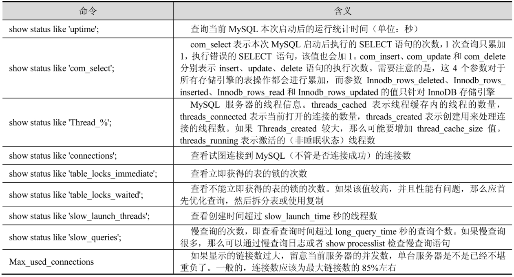

## 查看执行计划

MySQL 的 EXPLAIN 命令用于查看 SQL 语句的查询执行计划（QEP）。从这条命令的输出结果中就能够了解 MySQL 优化器是如何执行 SQL 语句的，用来帮助做出调优决策。

MySQL 的 EXPLAIN 语法可以运行在 SELECT 语句或者特定表上。如果作用在表上，那么此命令等同于 DESC 表命令。

MySQL 优化器是基于开销来工作的，它并不提供任何的 QEP 的位置。这意味着 QEP 是在每条 SQL 语句执行的时候动态地计算出来的。在 MySQL 存储过程中的 SQL 语句也是在每次执行时计算 QEP 的。存储过程缓存仅仅解析查询树。

```sql
CREATE TABLE t_4
(
    id   INT,
    name VARCHAR(20),
    age  INT,
    INDEX MULTI (id, name, age)
);
```

EXPLAIN 和 DESC 都可以生成执行计划。

```sql
SHOW CREATE TABLE t_4;
```

```sql
CREATE TABLE `t_4` (
  `id` int DEFAULT NULL,
  `name` varchar(20) DEFAULT NULL,
  `age` int DEFAULT NULL,
  KEY `MULTI` (`id`,`name`,`age`)
) ENGINE=InnoDB DEFAULT CHARSET=utf8mb4 COLLATE=utf8mb4_0900_ai_ci
```

```sql
INSERT INTO t_4
VALUES (1, 'a', 1),
       (2, 'b', 2),
       (3, 'c', 3),
       (4, 'd', 4),
       (5, 'e', 5),
       (6, 'f', 6),
       (7, 'g', 7),
       (8, 'h', 8),
       (9, 'i', 9),
       (10, 'j', 10);

EXPLAIN SELECT * FROM t_4 WHERE id < 4;
```

### 执行计划中每列的含义

```json
[
  {
    "id": 1,
    "select_type": "SIMPLE",
    "table": "t_4",
    "partitions": null,
    "type": "range",
    "possible_keys": "MULTI",
    "key": "MULTI",
    "key_len": "5",
    "ref": null,
    "rows": 3,
    "filtered": 100,
    "Extra": "Using where; Using index"
  }
]
```

### id

id 包含一组数字，表示查询中执行 SELECT 子句或操作表的顺序；执行顺序从大到小执行；当 id 值一样的时候，执行顺序由上往下。

### select_type

select_type 表示查询中每个 SELECT 子句的类型，最常见的值包括 SIMPLE、PRIMARY、DERIVED 和 UNION。其他可能的值还有 UNION RESULT、DEPENDENT SUBQUERY、DEPENDENT UNION、UNCACHEABLE UNION 以及 UNCACHEABLE QUERY。

这些类型的含义如下：

- SIMPLE：查询中不包含子查询、表连接或者 UNION 等其他复杂语法的简单查询，这是一个常见的类型。
- PRIMARY：查询中若包含任何复杂的子查询，则最外层查询被标记为 PRIMARY。这个类型通常可以在 DERIVED 和 UNION 类型混合使用时见到。
- SUBQUERY：在 SELECT 或 WHERE 列表中包含了子查询，该子查询被标记为 SUBQUERY。
- DERIVED：在 FROM 列表中包含的子查询被标记为 DERIVED（衍生），或者说当一个表不是一个物理表时，那么就被称为 DERIVED
- UNION：若第二个 SELECT 出现在 UNION 之后，则被标记为 UNION，即 UNION 中的第二个或后面的查询语句会被标记为 UNION ；若 UNION 包含在 FROM 子句的子查询中，外层 SELECT 将被标记为 DERIVED。
- UNION RESULT：从 UNION 表获取结果的 SELECT 被标记为 UNION RESULT。这是一系列定义在 UNION 语句中的表的返回结果。当 select_type 为这个值时，经常可以看到 table 的值是 `<unionN,M>`，这说明匹配的 id 行是这个集合的一部分。
- DEPENDENT SUBQUERY：这个 select-type 值是为使用子查询而定义的。

### type

type 表示 MySQL 在表中找到所需行的方式，又称“访问类型”，常见类型有以下几种，从上到下，性能由最差到最好。

- ALL：全表扫描（Full Table Scan），MySQL 将进行全表扫描。
- index：索引全扫描（Index Full Scan），MySQL 将遍历整个索引来查询匹配的行，index 与 ALL 区别为 index 类型只遍历索引树。
- range：索引范围扫描（Index Range Scan），对索引的扫描开始于某一点，返回匹配值域的行，常见于 BETWEEN、<、>、>=、<=的查询。需要注意的是，若 WHERE 条件中使用了 IN，则该列也是显示 range。
- ref：返回匹配某个单独值的所有行，常见于使用非唯一索引或唯一索引的非唯一前缀进行的查找。此外，ref 还经常出现在 join 操作中。
- eq_ref：唯一性索引扫描，对于每个索引键，表中只有一条记录与之匹配。常见于主键或唯一索引扫描，即在多表连接中，使用主键或唯一索引作为连接条件。
- const：当 MySQL 对查询某部分进行优化，并转换为一个常量时，使用这些类型访问。例如，将主键列或唯一索引列置于 WHERE 列表中，此时，MySQL 就能将该查询转换为一个常量 const。单表中最多只有 1 个匹配行，所以查询非常迅速，则这个匹配行中的其他列的值就可以被优化器在当前查询中当作常量来处理。
- system：表中只有一行数据或者是空表，且只能用于 myisam 和 memory 表。如果是 Innodb 引擎表，那么 type 列通常都是 ALL 或者 index。
- NULL：MySQL 在优化过程中分解语句，执行时不用访问表或索引就能直接得到结果。
类型 type 还有其他值，如 ref_or_null（与 ref 类似，区别在于条件中包含对 NULL 的查询）、index_merge（索引合并优化）、unique_subquery（in 的后面是一个查询主键字段的子查询）、index_subquery（与 unique_subquery 类似，区别在于 in 的后面是一个查询非唯一索引字段的子查询）、fulltext（全文索引检索，要注意，全文索引的优先级很高，若全文索引和普通索引同时存在时，MySQL 不会考虑代价，优先选择使用全文索引）等。

### possible_keys

possible_keys 表示查询时可能使用到的索引，指出 MySQL 能使用哪个索引在表中找到行，若查询涉及的字段上存在索引，则该索引将被列出，但不一定被查询使用。一个会列出大量可能的索引（例如多于 3 个）的 QEP 意味着备选索引数量太多了，同时也可能提示存在一个无效的单列索引。

### key

key 显示 MySQL 在查询中实际使用的索引，若没有使用索引，则显示为 NULL。若查询中使用了覆盖索引，则该索引仅出现在 key 列表中。一般来说 SQL 查询中的每个表都仅使用一个索引。

### key_len

key_len 表示使用到索引字段的长度，可通过该列计算查询中使用的索引的长度。此列的值对于确认索引的有效性以及多列索引中用到的列的数目很重要。

常见的计算规律为：

- 1 个 utf8 字符集的字符占用 3 个字节； 1 个 gbk 字符集的字符占用 2 个字节。
- 对于变长的类型（VARCHAR），key_len 还要加 2 字节；若字段允许为空，则 key_len 需要加 1。
- INT 类型的长度为 4。
- 对于 DATATIME 类型的字段，DATATIME 最大小数位是 6。若小数位长度为 1 或 2，则总字节数为 6（5+1）；若小数位为 3 或 4，则总字节数为 7（5+2）；若小数位为 5 或 6，则总字节数为 8（5+3）。

由此可见，是否可以为空、可变长度的列以及 key_len 列的值只与用在连接和 WHERE 条件中的索引的列有关。索引中的其他列会在 ORDER BY 或者 GROUP BY 语句中被用到。

### ref

ref 表示上述表的连接匹配条件，即那些列或常量被用于查找索引列上的值。

### rows

rows 表示 MySQL 根据表统计信息及索引选用情况，估算找到所需的记录所需要读取的行数。

### Extra

Extra 包含不适合在其他列中显示但十分重要的额外信息：

- Using where：表示 MySQL 服务器在存储引擎收到记录后进行“后过滤”，如果查询未能使用索引，那么 Using where 的作用只是说明 MySQL 将用 where 子句来过滤结果集。如果用到了索引，那么行的限制条件是通过获取必要的数据之后处理读缓冲区来实现的。
- Using temporary：表示 MySQL 需要使用临时表来存储结果集，常见于排序和分组查询。这个值表示使用了内部临时（基于内存的）表。一个查询可能用到多个临时表。有很多原因都会导致 MySQL 在执行查询期间创建临时表。两个常见的原因是在来自不同表的列上使用了 DISTINCT，或者使用了不同的 ORDER BY 和 GROUP BY 列。
- Using filesort：MySQL 中无法利用索引完成的排序操作称为“文件排序”。这是 ORDER BY 语句的结果。这可能是一个 CPU 密集型的过程。可以通过选择合适的索引来改进性能，用索引来为查询结果排序。
- Using index：这个值重点强调了只需要使用索引就可以满足查询表的要求，不需要直接访问表数据，说明 MySQL 正在使用覆盖索引。
- Using join buffer：这个值强调了在获取连接条件时没有使用索引，并且需要连接缓冲区来存储中间结果。如果出现了这个值，那应该注意，根据查询的具体情况可能需要添加索引来改进性能。
- Impossible where：这个值强调了 where 语句会导致没有符合条件的行。
- Select tables optimized away：这个值意味着仅通过使用索引，优化器可能仅从聚合函数结果中返回一行。
- Distinct：这个值意味着 MySQL 在找到第一个匹配的行之后就会停止搜索其他行。
- Index merges：当 MySQL 决定要在一个给定的表上使用超过一个索引的时候，Index merges 就会出现，用来详细说明使用的索引以及合并的类型。

### table

table 列是 EXPLAIN 命令输出结果中的一个单独行的唯一标识符。这个值可能是表名、表的别名或者一个为查询产生临时表的标识符，如派生表、子查询或集合。下面是 QEP 中 table 列的一些示例：

- table:item
- table:<derivedN>
- table:<unionN,M>

表中 N 和 M 的值参考了另一个符合 id 列值的 table 行。相关的 QEP 列还有 select_type。

### partitions

partitions 列代表给定表所使用的分区。这一列只会在 EXPLAIN PARTITIONS 语句中出现。

### filtered

filtered 列给出了一个百分比的值，这个百分比值和 rows 列的值一起使用，可以估计出那些将要和 QEP 中的前一个表进行连接的行的数目。前一个表就是指 id 列的值比当前表的 id 小的表。这一列只有在 EXPLAIN EXTENDED 语句中才会出现。使用 EXPLAIN EXTENDED 和 SHOW WARNINGS 语句，能够看到 SQL 在真正被执行之前优化器做了哪些 SQL 改写。

## 分析 SQL 语句性能消耗

MySQL 可以使用 profile 分析 SQL 语句的性能消耗情况。例如，查询到 SQL 会执行多少时间，并显示 CPU、内存使用量，执行过程中系统锁及表锁的花费时间等信息。

通过 have_profiling 参数可以查看 MySQL 是否支持 profile，通过 profiling 参数可以查看当前系统 profile 是否开启。

```sql
SHOW VARIABLES LIKE '%profiling%';
```

```json
[
  {
    "Variable_name": "have_profiling",
    "Value": "YES"
  },
  {
    "Variable_name": "profiling",
    "Value": "OFF"
  },
  {
    "Variable_name": "profiling_history_size",
    "Value": "15"
  }
]
```

have_profiling 表示 MySQL 是否支持 profile。profiling 表示十分开启 SQL 语句剖析功能。

以下是有关 profile 的一些常用命令：

```sql
set profiling = 1 ; -- 基于会话级别开启，关闭则用 set profiling = off。

show profile for query 1 ; -- 1 是 query_id。

show profile cpu for query 1 ; -- 查看 CPU 的消耗情况。

show profile memory for query 1 ; -- 查看内存消耗情况。

show profile block io,cpu for query 1 ; -- 查看 I/O 及 CPU 的消耗情况。
```

命令 “show profile for query” 的结果中有 Sending data，该状态表示 MySQL 线程开始访问数据行并把结果返回给客户端，而不仅仅是返回结果给客户端。由于在 Sending data 状态下，MySQL 线程往往需要做大量的磁盘读取操作，所以经常是整个查询中耗时最长的状态。

可以使用如下的语句查询 SQL 的整体消耗百分比：

```sql
SELECT state,
       SUM(duration)                                                                                               AS total_r,
       ROUND(100 * SUM(duration) / (SELECT SUM(duration) FROM information_schema.profiling WHERE QUERY_ID = 1),
             2)                                                                                                    AS pct_r,
       COUNT(*)                                                                                                    AS calls,
       SUM(duration) / COUNT(*)                                                                                    AS 'r/call'
FROM information_schema.profiling
WHERE QUERY_ID = 1
GROUP BY state
ORDER BY total_r DESC;
```

profile 是一个非常量化的指标，可以根据这些量化指标来比较各项资源的消耗，有利于对 SQL 语句的整体把控。在获取到最消耗时间的线程状态后，MySQL 支持进一步选择 all、cpu、block io、context switch、page faults 等明细类型来查看 MySQL 在使用什么资源上耗费了过多的时间。

可以通过 show profile source for query 查看 SQL 解析执行过程中每个步骤对应的源码的文件、函数名以及具体的源文件行数。

## CHECK、OPTIMIZE 和 ANALYZE 的作用

- 分析表（ANALYZE）分析关键字的分布；
- 检查表（CHECK）检查表是否存在错误；
- 优化表（OPTIMIZE）消除删除或者更新造成的空间浪费。

## 如何对 MySQL 进行优化

一个成熟的数据库架构并不是一开始设计就具备高可用、高伸缩等特性，它是随着用户量的增加，基础架构才逐渐完善。

### 数据库的设计

1. 尽量让数据库占用更小的磁盘空间。
2. 尽可能使用更小的整数类型。
3. 尽可能地定义字段为 `NOT NULL`，除非这个字段需要 NULL。
4. 如果没有用到变长字段（例如 VARCHAR）的话，那么就采用固定大小的记录格式，例如 CHAR。
5. 只创建确实需要的索引。索引有利于检索记录，但是不利于快速保存记录。如果总是要在表的组合字段上做搜索，那么就在这些字段上创建索引。索引的第一部分必须是最常使用的字段。
6. 所有数据都得在保存到数据库前进行处理。
7. 所有字段都得有默认值。

### 系统的用途

1. 尽量使用长连接。
2. 通过 EXPLAIN 查看复杂 SQL 的执行方式，并进行优化。
3. 如果两个关联表要做比较，那么做比较的字段必须类型和长度都一致。
4. LIMIT 语句尽量要跟 `ORDER_BY` 或 DISTINCT 搭配使用，这样可以避免做一次 `FULL_TABLE_SCAN`。
5. 如果想要清空表的所有纪录，那么建议使用 `TRUNCATE_TABLE_TABLENAME` 而不是 `DELETE_FROM_TABLENAME`。
6. 在一条 INSERT 语句中采用多重记录插入格式，而且使用 load data infile 来导入大量数据，这比单纯的 INSERT 快很多。
7. 如果 DATE 类型的数据需要频繁地做比较，那么尽量保存为 `UNSIGNED_INT` 类型，这样可以加快比较的速度。

### 系统的瓶颈

1. 磁盘搜索。把数据分开存放到多个磁盘中，这样能加快搜索时间。
2. 磁盘读写。可以从多个媒介中并行的读取数据。
3. CPU 周期。数据存放在主内存中。这样就得增加 CPU 的个数来处理这些数据。
4. 内存带宽。当 CPU 要将更多的数据存放到 CPU 的缓存中来的话，内存的带宽就成了瓶颈。

### 数据库参数优化

#### 公共参数默认值

1. `max_connections = 151` 同时处理最大连接数，推荐设置最大连接数是上限连接数的 80% 左右。

2. `sort_buffer_size = 2M` 查询排序时缓冲区大小，只对 `ORDER_BY` 和 `GROUP_BY` 起作用，可增大此值为 16M。

3. `open_files_limit = 1024` 打开文件数限制，如果 `show global status like 'open_files' `查看的值等于或者大于 `open_files_limit` 值时，程序会无法连接数据库或卡死。

#### InnoDB 参数默认值

1. `innodb_buffer_pool_size = 128M` 索引和数据缓冲区大小，一般设置物理内存的 60%～70%。

2. `innodb_buffer_pool_instances = 1` 缓冲池实例个数，推荐设置 4 个或 8 个。

3. `innodb_flush_log_at_trx_commit = 1` 关键参数，0 代表大约每秒写入到日志并同步到磁盘，数据库故障会丢失 1s 左右事务数据。1 为每执行一条 SQL 后写入到日志并同步到磁盘，I/O 开销大，执行完 SQL 要等待日志读写，效率低。2 代表只把日志写入到系统缓存区，再每秒同步到磁盘，效率很高，如果服务器故障，才会丢失事务数据。对数据安全性要求不是很高的推荐设置 2，性能高，修改后效果明显。

4. `innodb_file_per_table = OFF` 默认是共享表空间，共享表空间 idbdata 文件不断增大，影响一定的 I/O 性能。推荐开启独立表空间模式，每个表的索引和数据都存在自己独立的表空间中，可以实现单表在不同数据库中移动。

5. `innodb_log_buffer_size = 8M` 日志缓冲区大小，由于日志最长每秒钟刷新一次，所以一般不用超过 16M

### 系统内核优化

大多数 MySQL 都部署在 Linux 系统上，所以，操作系统的一些参数也会影响到 MySQL 性能，以下参数的设置可以对 Linux 内核进行适当优化。

1. `net.ipv4.tcp_fin_timeout=30` TIME_WAIT 超时时间，默认是 60s。

2. `net.ipv4.tcp_tw_reuse=1` 表示开启复用，允许 TIME_WAIT socket 重新用于新的 TCP 连接，0 表示关闭。

3. `net.ipv4.tcp_tw_recycle=1` 表示开启 TIME_WAIT socket 快速回收，0 表示关闭。

4. `net.ipv4.tcp_max_tw_buckets=4096` 系统保持 TIME_WAIT socket 最大数量，如果超出这个数，系统将随机清除一些 TIME_WAIT 并打印警告信息。

5. `net.ipv4.tcp_max_syn_backlog=4096` 进入 SYN 队列最大长度，加大队列长度可容纳更多的等待连接。

在 Linux 系统中，如果进程打开的文件句柄数量超过系统默认值 1024，就会提示 `too many files open` 信息，所以，要调整打开文件句柄限制。

vi/etc/security/limits.conf

加入以下配置，*代表所有用户，也可以指定用户，重启系统生效。

```
* soft nofile 65535
* hard nofile 65535
```

立刻生效

```bash
ulimit-SHn 65535
```

### 硬件配置

硬件配置应加大物理内存，提高文件系统性能。Linux 内核会从内存中分配出缓存区（系统缓存和数据缓存）来存放热数据，通过文件系统延迟写入机制，等满足条件时（如缓存区大小到达一定百分比或者执行 sync 命令）才会同步到磁盘。也就是说物理内存越大，分配缓存区越大，缓存数据越多。当然，服务器故障会丢失一定的缓存数据。可以采用 SSD（Solid State Drives，固态硬盘）硬盘代替 SAS（Serial Attached SCSI，串行连接 SCSI）硬盘，将 RAID（Redundant Arrays of Independent Disks，磁盘阵列）级别调整为 RAID1+0，相对于 RAID1 和 RAID5 它有更好的读写性能（IOPS，Input/Output Operations Per Second，即每秒进行读写（I/O）操作的次数），毕竟数据库的压力主要来自磁盘 I/O 方面。

## SQL 优化

执行缓慢的 SQL 语句大约能消耗数据库 70%～90% 的 CPU 资源，而 SQL 语句独立于程序设计逻辑，相对于对程序源代码的优化，对 SQL 语句的优化在时间成本和风险上的代价都很低。SQL 语句可以有不同的写法。

### 避免使用子查询

子查询是指在 SELECT、UPDATE 或 DELETE 子句中嵌套 SELECT 语句的查询。

若执行下面的 SQL 语句，则内部执行计划器是这样执行的：先查外表再匹配内表，而不是先查内表 T2。所以，当外表的数据很大时，查询速度就会非常慢。

```sql
SELECT * FROM T1 WHERE T1.ID IN (SELECT T2.ID FROM T2 WHERE T2.ID = 1);
```

可以使用 JOIN 代替子查询，这样就可以避免子查询的问题。

```sql
SELECT * FROM T1 JOIN T2 ON T1.ID = T2.ID WHERE T2.ID = 1;
```

### 避免函数索引

例如下面的 SQL 语句会使用全表扫描：

```sql
SELECT * FROM T1 WHERE SUBSTR(T1.NAME, 1, 1) = 'A';
```

由于 MySQL 不支持函数索引，即使 D 字段有索引，也会使用全表扫描。

### 用 IN 代替 OR

```sql
SELECT * FROM T1 WHERE T1.ID = 1 OR T1.ID = 2 OR T1.ID = 3;
```

可以改写为：

```sql
SELECT * FROM T1 WHERE T1.ID IN (1, 2, 3);
```

### 在 LIKE 中首字符为通配符无法使用索引

```sql
SELECT * FROM T1 WHERE T1.NAME LIKE '%A';
```

```sql
SELECT * FROM T1 WHERE T1.NAME LIKE 'A%';
```

在以上 SQL 语句中，第一句 SQL 无法使用索引，而第二句可以使用索引。

### 读取适当的记录 LIMIT M,N

```sql
SELECT * FROM T1 LIMIT 1000, 100;
```

### 避免数据类型不一致

```sql
SELECT * FROM T1 WHERE T1.ID = '1';
```

由于以上 SQL 中 ID 为数值型，而'1'为字符串型，所以无法使用索引。

### 分组统计可以禁止排序

```sql
SELECT T1.ID, COUNT(*) FROM T1 GROUP BY T1.ID;
```

可以改写为：

```sql
SELECT T1.ID, COUNT(*) FROM T1 GROUP BY T1.ID ORDER BY NULL;
```

### 避免随机取记录

```sql
SELECT * FROM T1 ORDER BY RAND() LIMIT 1;
```

### 尽量使用批量 INSERT 插入

```sql
INSERT INTO T1 VALUES (1, 'A'), (2, 'B'), (3, 'C');
```

## 对 SQL 语句进行跟踪

通过 trace 文件可以进一步了解优化器是如何选择某个执行计划的。

在使用时需要先打开设置，然后执行一次 SQL，最后查看 information_schema.optimizer_trace 表的内容。需要注意的是，该表为临时表，只能在当前会话进行查询，每次查询返回的都是最近一次执行的 SQL 语句。

```sql
SHOW VARIABLES LIKE '%trace%';
```

## 查看 SQL 的执行频率

MySQL 客户端连接成功后，可以通过 `show [session|global]` 命令查询服务器的状态信息，也可以在操作系统上使用 `mysqladmin extended-status` 命令获取这些信息。



## 定位执行效率较低的 SQL 语句

可以通过以下 2 种办法来定位执行效率较低的 SQL 语句：

1. 通过慢查询日志定位。可以通过慢查询日志定位那些已经执行完毕的 SQL 语句。

2. 使用 `SHOW_PROCESSLIST` 来查询。慢查询日志在查询结束以后才记录，所以，在应用反应执行效率出现问题的时候查询慢查询日志并不能定位问题。此时，可以使用 `SHOW_PROCESSLIST` 命令查看当前 MySQL 正在进行的线程，包括线程的状态、是否锁表等，可以实时地查看 SQL 的执行情况，同时对一些锁表操作进行优化。

找到执行效率低的 SQL 语句后，就可以通过 `SHOW_PROFILE_FOR_QUERY_N`、`EXPLAIN` 或 `trace` 等方法来优化这些 SQL 语句。

## 如何对 MySQL 的大表优化

当 MySQL 单表记录数过大时，数据库的 CRUD，C 即 Create，表示增加；R 即 Retrieve，表示读取查询；U 即 Update，表示更新；D 即 Delete，表示删除。性能会明显下降，一些常见的优化措施如下：

1. 限定数据的范围：务必禁止不带任何限制数据范围条件的查询语句。例如：当用户在查询订单历史的时候，可以控制在一个月范围内。

2. 读写分离：经典的数据库拆分方案，主库负责写，从库负责读。

3. 缓存：使用 MySQL 的缓存。另外对重量级、更新少的数据可以考虑使用应用级别的缓存。

4. 垂直分区：根据数据库里面数据表的相关性进行拆分。例如，用户表中既有用户的登录信息又有用户的基本信息，可以将用户表拆分成两个单独的表，甚至放到单独的库做分库。

简单来说垂直拆分是指数据表列的拆分，把一张列比较多的表拆分为多张表。

垂直拆分的优点如下：可以使得行数据变小，在查询时减少读取的 Block 次数，减少 I/O 次数。此外，垂直分区可以简化表的结构，易于维护。

垂直拆分的缺点：主键会出现冗余，需要管理冗余列，并会引起 Join 操作，可以通过在应用层进行 Join 来解决。此外，垂直分区会让事务变得更加复杂。

5. 水平分区：保持数据表结构不变，通过某种策略存储数据分片。这样每一片数据分散到不同的表或者库中，达到了分布式的目的。水平拆分可以支撑非常大的数据量。

水平拆分是指数据表行的拆分，在表的行数超过 200 万行时，就会变慢，这时可以把一张表的数据拆成多张表来存放。例如：可以将用户信息表拆分成多个用户信息表，这样就可以避免单一表数据量过大对性能造成影响。

水平拆分可以支持非常大的数据量。需要注意的是，分表仅仅是解决了单一表数据过大的问题，但由于表的数据还是在同一台机器上，其实对于提升 MySQL 并发能力没有什么意义，所以**水平拆分最好分库**。

水平拆分能够支持非常大的数据量存储，引用程序需要的改动也很少，但分片事务难以解决，跨节点 Join 性能较差，逻辑复杂。

```sql

```
