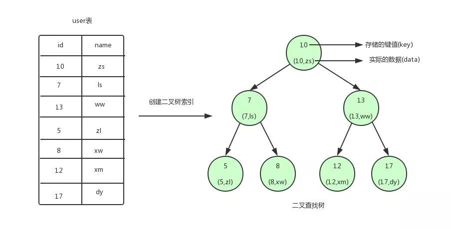
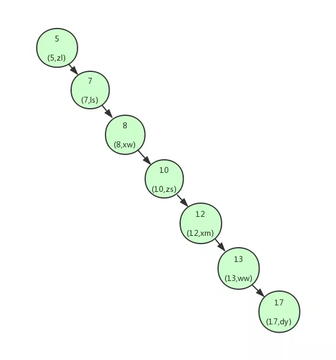
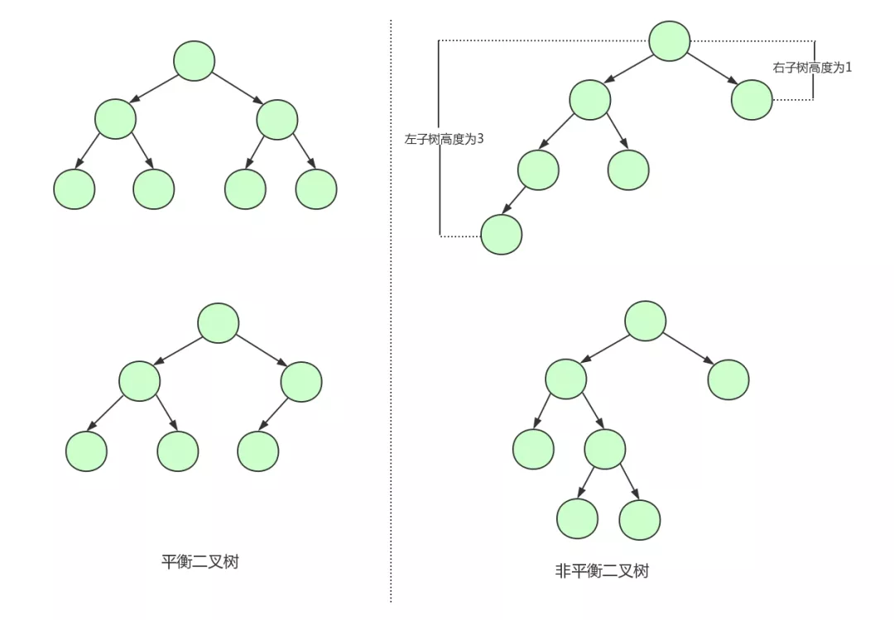
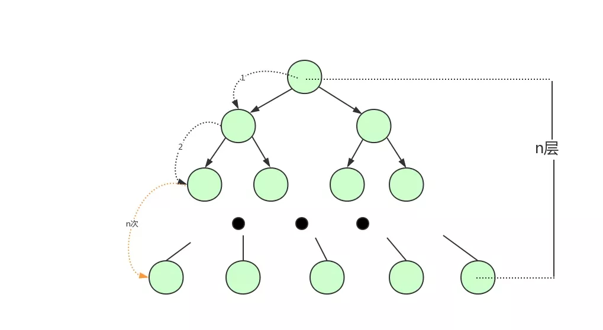
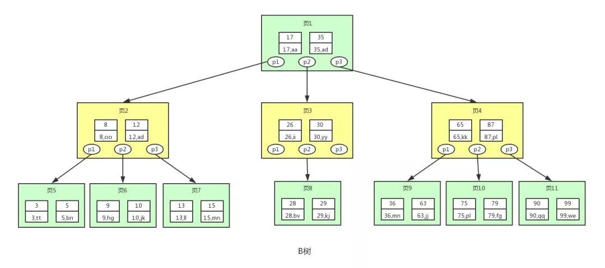
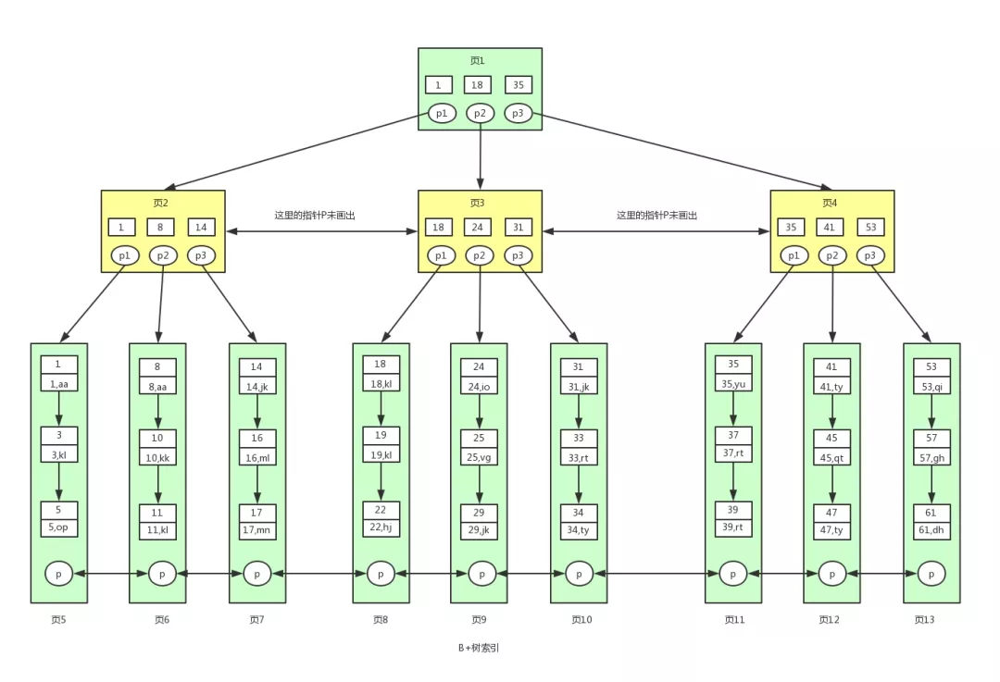
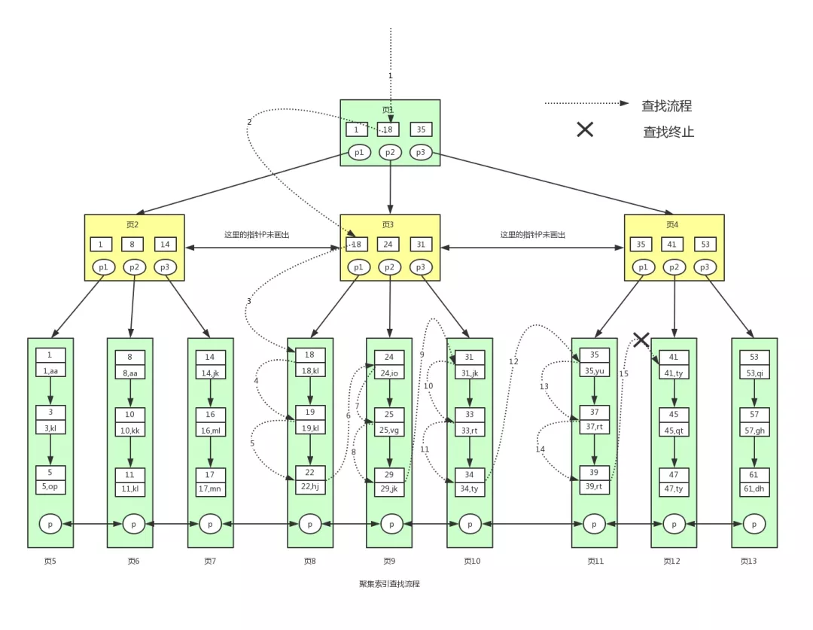
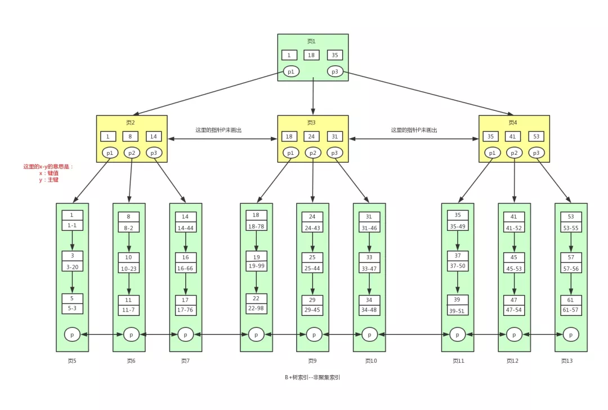
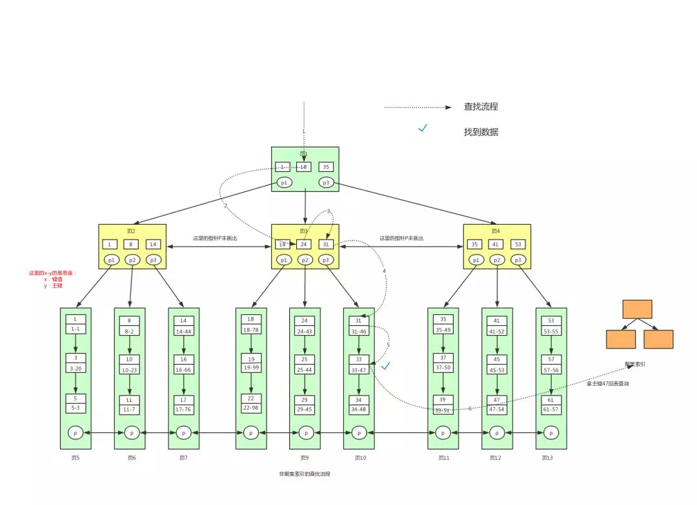

索引是一种数据结构，用于在大量数据中快速定位到查找的数据， 索引就相当于书籍的目录。数据量大了索引才显得有意义。

B+ 树是从二叉查找树，平衡二叉树和 B 树这三种数据结构演化来的。

## 二叉查找树

首先，让我们先看一张图

从图中可以看到，我们为 user 表（用户信息表）建立了一个二叉查找树的索引。图中的圆为二叉查找树的节点，节点中存储了键(key)和数据(data)。

键对应 user 表中的 id，数据对应 user 表中的行数据。二叉查找树的特点就是任何节点的左子节点的键值都小于当前节点的键值，右子节点的键值都大于当前节点的键值。 顶端的节点我们称为根节点，没有子节点的节点我们称之为叶节点。 

如果我们需要查找 id = 12 的用户信息，利用我们创建的二叉查找树索引，查找流程如下： 

1. 将根节点作为当前节点，把 12 与当前节点的键值 10 比较，12 大于 10，接下来我们把当前节点 > 的右子节点作为当前节点。

2. 继续把 12 和当前节点的键值 13 比较，发现 12 小于 13，把当前节点的左子节点作为当前节点。

3. 把 12 和当前节点的键值 12 对比，12 等于 12，满足条件，我们从当前节点中取出 data，即 id = 12,name = xm。

利用二叉查找树我们只需要 3 次即可找到匹配的数据。如果在表中一条条的查找的话，我们需要 6 次才能找到。

## 平衡二叉树

上面我们讲解了利用二叉查找树可以快速的找到数据。但是，如果上面的二叉查找树是这样的构造：

这个时候可以看到我们的**二叉查找树变成了一个链表**。

如果我们需要查找 id = 17 的用户信息，我们需要查找7次，也就**相当于全表扫描**了。 

导致这个现象的原因其实是二叉查找树变得不平衡了，也就是高度太高了，从而导致查找效率的不稳定。

为了解决这个问题，我们需要保证二叉查找树一直保持平衡，就需要用到平衡二叉树了。 

平衡二叉树又称 AVL 树，在满足二叉查找树特性的基础上，要求每个节点的左右子树的高度差不能超过 1。 

下面是平衡二叉树和非平衡二叉树的对比：

由平衡二叉树的构造我们可以发现第一张图中的二叉树其实就是一棵平衡二叉树。

平衡二叉树保证了树的构造是平衡的，当我们插入或删除数据导致不满足平衡二叉树不平衡时，平衡二叉树会进行调整树上的节点来保持平衡。

平衡二叉树相比于二叉查找树来说，查找效率更稳定，总体的查找速度也更快。

## B 树

因为内存的易失性。一般情况下，我们都会选择将 user 表中的数据和索引存储在磁盘这种外围设备中。

但是和内存相比，从磁盘中读取数据的速度会慢上百倍千倍甚至万倍，所以，我们应当尽量减少从磁盘中读取数据的次数。 另外，从磁盘中读取数据时，都是按照磁盘块来读取的，并不是一条一条的读。 

如果我们能把尽量多的数据放进磁盘块中，那一次磁盘读取操作就会读取更多数据，那我们查找数据的时间也会大幅度降低。 

如果我们用树这种数据结构作为索引的数据结构，那我们每查找一次数据就需要从磁盘中读取一个节点，也就是我们说的一个磁盘块，我们都知道平衡二叉树可是**每个节点只存储一个键值和数据**的。说明每个磁盘块仅仅存储一个键值和数据。**如果要存储海量的数据，可以想象到二叉树的节点将会非常多，高度也会极其高**，我们查找数据时也会进行很多次磁盘 IO，我们**查找数据的效率将会极低**。

为了解决平衡二叉树的这个弊端，我们应该寻找一种**单个节点可以存储多个键值和数据的平衡树**。也就是我们接下来要说的 B 树。 

B 树 (Balance Tree) 即为平衡树的意思，下图即是一颗 B 树。

图中的每个节点称为页，页就是我们上面说的磁盘块，在 MySQL 中数据读取的基本单位都是页，所以我们这里叫做页更符合 MySQL 中索引的底层数据结构。

从上图可以看出，B 树相对于平衡二叉树，每个节点存储了更多的键值 (key) 和数据 (data)，并且每个节点拥有更多的子节点，子节点的个数一般称为阶，上述图中的 B 树为 3 阶 B 树，高度也会很低。基于这个特性，B 树查找数据读取磁盘的次数将会很少，数据的查找效率也会比平衡二叉树高很多。

假如我们要查找 id = 28 的用户信息，那么我们在上图B树中查找的流程如下： 

1. 先找到根节点也就是页 1，判断 28 在键值 17 和 35 之间，我们那么我们根据页 1 中的指针 p2 找到页 3。
2. 将 28 和页 3 中的键值相比较，28 在 26 和 30 之间，我们根据页 3 中的指针 p2 找到页 8。
3. 将 28 和页 8 中的键值相比较，发现有匹配的键值 28，键值 28 对应的用户信息为 (28,bv)。

## B+ 树

B+ 树是对 B 树的进一步优化。让我们先来看下 B+ 树的结构图：

根据上图我们来看下 B+ 树和 B 树有什么不同。 

1. **B+ 树非叶子节点上是不存储数据的，仅存储键值**，而 B 树节点中不仅存储键值，也会存储数据。之所以这么做是因为在数据库中页的大小是固定的，innodb 中页的默认大小是 16KB。**如果不存储数据，那么就会存储更多的键值**，相应的树的阶数（节点的子节点树）就会更大，树就会更矮更胖，如此一来我们**查找数据进行磁盘的 IO 次数有会再次减少，数据查询的效率也会更快**。另外，B+ 树的阶数是等于键值的数量的，如果我们的 B+ 树一个节点可以存储 1000 个键值，那么 3 层 B+ 树可以存储 1000×1000×1000 = 10 亿个数据。一般根节点是常驻内存的，所以一般我们查找 10 亿数据，只需要 2 次磁盘 IO。

2. 因为 B+ 树索引的**所有数据均存储在叶子节点，而且数据是按照顺序排列的。那么 B+ 树使得范围查找，排序查找，分组查找以及去重查找变得异常简单**。而 B 树因为数据分散在各个节点，要实现这一点是很不容易的。

上图 B+ 树中**各个页之间是通过双向链表连接的**，**叶子节点中的数据是通过单向链表连接的**。

其实上面的 B 树我们也可以对各个节点加上链表。其实这些不是它们之前的区别，是因为在 MySQL 的 innodb 存储引擎中，索引就是这样存储的。也就是说上图中的 B+ 树索引就是 innodb 中 B+ 树索引真正的实现方式，准确的说应该是聚集索引。

通过上图可以看到，在 innodb 中，我们通过数据页之间通过双向链表连接以及叶子节点中数据之间通过单向链表连接的方式可以找到表中所有的数据。

## 聚集索引和非聚集索引

在 MySQL 中，B+ 树**索引按照存储方式的不同分为聚集索引和非聚集索引**。

1. 聚集索引（聚簇索引）：以 innodb 作为存储引擎的表，表中的数据都会有一个主键，即使你不创建主键，系统也会帮你创建一个隐式的主键。这是因为 innodb 是把数据存放在 B+ 树中的，而 B+ 树的键值就是主键，在 B+ 树的叶子节点中，存储了表中所有的数据。这种**以主键作为 B+ 树索引的键值而构建的 B+ 树索引**，我们称之为聚集索引。

2. 非聚集索引（非聚簇索引）：**以主键以外的列值作为键值构建的 B+ 树索引**，我们称之为非聚集索引。非聚集索引与聚集索引的区别在于**非聚集索引的叶子节点不存储表中的数据，而是存储该列对应的主键**，想要查找数据我们**还需要根据主键再去聚集索引中进行查找**，这个再根据聚集索引查找数据的过程，我们称为回表。

## 利用聚集索引查找数据

还是这张 B+ 树索引图，现在我们应该知道这就是聚集索引，表中的数据存储在其中。

现在假设我们要查找 id>=18 并且 id<40 的用户数据。对应的 sql 语句为 `select * from user where id>=18 and id <40`，其中 id 为主键。具体的查找过程如下：

1. 一般根节点都是常驻内存的，也就是说页 1 已经在内存中了，此时不需要到磁盘中读取数据，直接从内存中读取即可。从内存中读取到页 1，要查找这个 `id>=18 and id <40` 或者范围值，我们首先需要找到 id = 18 的键值。从页 1 中我们可以找到键值 18，此时我们需要根据指针 p2，定位到页 3。

2. 要从页 3 中查找数据，我们就需要拿着 p2 指针去磁盘中进行读取页 3。从磁盘中读取页 3 后将页 3 放入内存中，然后进行查找，我们可以找到键值 18，然后再拿到页 3 中的指针 p1，定位到页 8。

3. 同样的页 8 页不在内存中，我们需要再去磁盘中将页 8 读取到内存中。将页 8 读取到内存中后。因为页中的数据是链表进行连接的，而且键值是按照顺序存放的，此时可以根据二分查找法定位到键值 18。此时因为已经到数据页了，此时我们已经找到一条满足条件的数据了，就是键值 18 对应的数据。因为是范围查找，而且此时所有的数据又都存在叶子节点，并且是有序排列的，那么我们就可以对页 8 中的键值依次进行遍历查找并匹配满足条件的数据。我们可以一直找到键值为 22 的数据，然后页 8 中就没有数据了，此时我们需要拿着页 8 中的 p 指针去读取页 9 中的数据。

4. 因为页 9 不在内存中，就又会加载页 9 到内存中，并通过和页 8 中一样的方式进行数据的查找，直到将页 12 加载到内存中，发现 41 大于 40，此时不满足条件。那么查找到此终止。最终我们找到满足条件的所有数据为：`(18,kl),(19,kl),(22,hj),(24,io),(25,vg),(29,jk),(31,jk),(33,rt),(34,ty),(35,yu),(37,rt),(39,rt)` 总共 12 条记录。

下面看下具体的查找流程图：

## 利用非聚集索引查找数据

在叶子节点中，不存储所有的数据，存储的是键值和主键。

查找的流程跟聚集索引一样，最终会找到主键值 47，找到主键后我们需要再到聚集索引中查找具体对应的数据信息，此时又回到了聚集索引的查找流程。  

下面看下具体的查找流程图：

