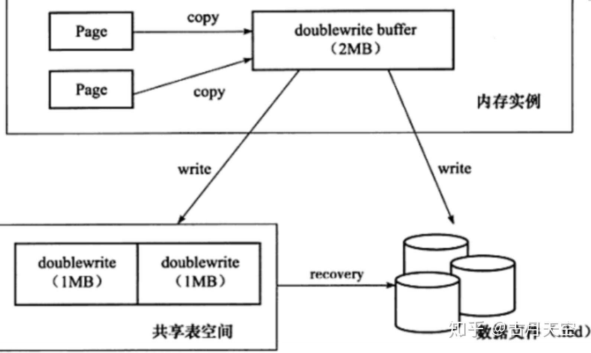
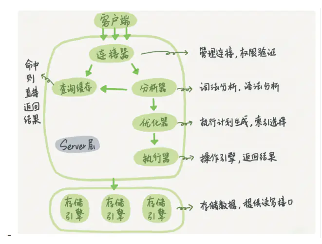
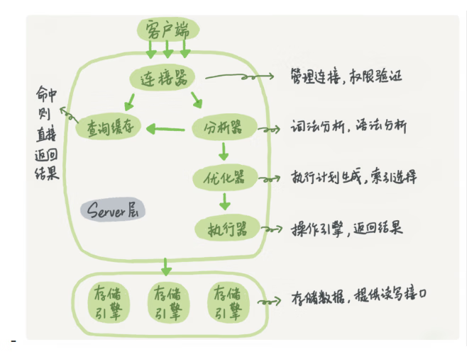

## 4 大特性

### 插入缓冲(insert buffer)

必须是非聚集索引，非唯一索引。

避免读取索引页，如果是唯一索引，在插入时需要判断插入的记录是否唯一，这需要读取辅助索引页。

### 二次写(second write)

1. doublewrite 缓存位于系统表空间的存储区域，用来缓存 innodb 的数据页从 innodb buffer pool 中 flush 之后并写入到数据文件之前；
2. 当操作系统或数据库进程在数据页写入磁盘的过程中崩溃，可以在 doublewrite 缓存中找到数据页的备份，用来执行 crash 恢复；
3. 数据页写入到 doublewrite 缓存的动作所需要的 io 消耗要小于写入到数据文件的消耗，因为此写入操作会以一次大的连续块的方式写入；



根据上图知道：

1. 1. 内存中 doublewrite buffer 大小 2M ；物理磁盘上共享表空间中连续的 128 个页，也就是 2 个区（extent）大小同样为 2M ；

   2. 对缓冲池脏页进行刷新时，不是直接写磁盘。

   3. 1. 第一步：通过memcpy()函数将脏页先复制到内存中的doublewrite buffer；
      2. 第二步：通过doublewrite分两次，每次1M顺序的写入共享表空间的物理磁盘上。这个过程中，doublewrite页是连续的，因此这个过程是顺序的，所以开销并不大；
      3. 第三步：完成doublewrite页的写入后，再将doublewrite buffer中的页写入各个表空间文件中，此时写入是离散的，可能会较慢；
      4. 如果操作系统在第三步的过程中发生了崩溃，在恢复过程中，可以从共享表空间中的doublewrite中找到该页的一个副本，将其复制到表空间文件中，再应用重做日志；

### 自适应哈希索引(adaptive hash index)

innodb 存储引擎会监控对表上二级索引的查找，如果发现某二级索引被频繁访问，此索引成为热数据，建立 hash 索引以提升查询速度，此建立是自动建立哈希索引，故称为自适应哈希索引（adaptive hash index）。

自适应哈希索引会占用 innodb buffer pool。

只适合搜索等值(=)的查询，对于范围查找等操作，是不能使用的。

### 预读(read ahead)

#### 两种预读算法

- 线性预读：以 extent 为单位，将下一个 extent 提前读取到 buffer pool 中。
- 随机预读：以 extent 中的 page 为单位，将当前 extent 中的剩余的 page 提前读取到 buffer pool 中。

#### innodb_read_ahead_threshold 参数

控制什么时间（访问 extent 中多少页的阈值）触发预读，默认 56，范围 0～64，值越高，访问模式检查越严格。

没有该变量之前，当访问到 extent 最后一个 page 时，innodb 会决定是否将下一个 extent 放入到 buffer pool 中。

## 一条 SQL 语句在 MySQL 中如何执行的？



### 查询语句：

- 先检查该语句是否有权限
- 如果没有权限，直接返回错误信息
- 如果有权限，先查询缓存。
- 如果没有缓存，分析器进行词法分析，提取 sql 语句 select 等的关键元素。然后判断 sql 语句是否有语法错误，比如关键词是否正确等等。
- 优化器进行确定执行方案
- 进行权限校验，如果没有权限就直接返回错误信息，如果有权限就会调用数据库引擎接口，返回执行结果。

## InnoDB 引擎中的索引策略

- 覆盖索引
- 最左前缀原则
- 索引下推
- 索引下推优化， 可以在索引遍历过程中，对索引中包含的字段先做判断，直接过滤掉不满足条件的记录，减少回表次数。

## MySQL 的基础架构图



- 第一层负责连接处理，授权认证，安全等等
- 第二层负责编译并优化 SQL
- 第三层是存储引擎。

```sql

```
