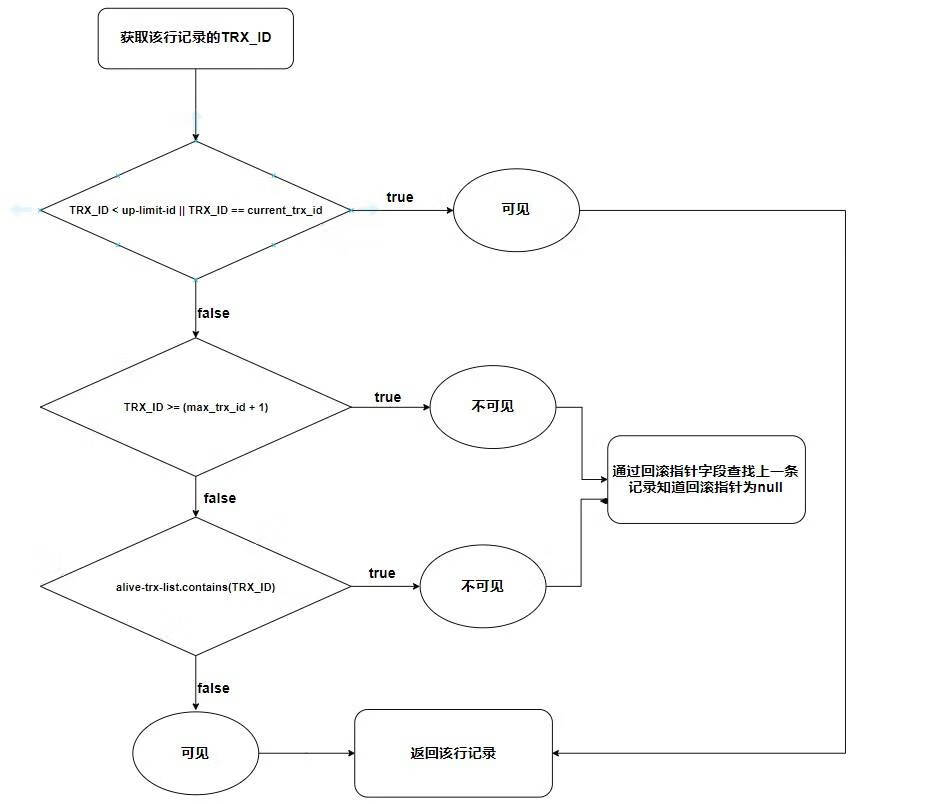

## 简介

Multi Version concurrency control (MVCC) 多版本并发控制，是数据库管理系统一种常见的并发控制。

我们知道并发控制常用的是锁，当线程要对一个共享资源进行操作的时候，加锁是一种非常简单粗暴的方法，这种锁是一种悲观的实现方式，也就是说这会给其他事务造成堵塞，从而影响数据库性能。

- 悲观锁： 当一个线程需要对共享资源进行操作的时候，首先对共享资源进行加锁，当该线程持有该资源的锁的时候，其他线程对该资源进行操作的时候会被阻塞。
- 乐观锁：当一个线程需要对一个共享资源进行操作的时候，不对它进行加锁，而是在操作完成之后进行判断。比如乐观锁会通过一个版本号控制，如果操作完成后通过版本号进行判断在该线程操作过程中是否有其他线程已经对该共享资源进行操作了，如果有则通知操作失败，如果没有则操作成功。

MVCC 是通过一种可见性算法来实现数据库并发控制。

## MVCC 的两种读形式

快照读：读取的只是当前事务的可见版本，不用加锁。简单的 select 操作就是快照读。

当前读：读取的是当前版本，比如 特殊的读操作，更新/插入/删除操作

## MVCC 的实现原理

MVCC 使用了“三个隐藏字段”来实现版本并发控制，MySQL 在建表的时候 innoDB 创建三个隐藏列。

| RowID | DB_TRX_ID | DB_ROLL_PTR | id | name | password |
| ---- | ---- | ---- | ---- | ---- | ---- |
|自动创建的 id |事务 id |回滚指针| id | name | password |

- RowID：隐藏的自增 ID，当建表没有指定主键，InnoDB 会使用该 RowID 创建一个聚簇索引。
- DB_TRX_ID：最近修改（更新/删除/插入）该记录的事务 ID。
- DB_ROLL_PTR：回滚指针，指向这条记录的上一个版本。

其实还有一个删除的 flag 字段，用来判断该行记录是否已经被删除。

而 MVCC 使用的是其中的事务字段，回滚指针字段，是否删除字段。我们来看一下现在的表格。

| flag | DB_TRX_ID | DB_ROLL_PTR | id | name | password |
| ---- | ---- | ---- | ---- | ---- | ---- |
| true/false | 事务 id |回滚指针 | id | name | password |

可见性的算法的流程图

其实 MVCC 是通过三个隐藏字段 ( 事务 id, 回滚指针, 删除标志 ) 加上 undo log 和可见性算法来实现的版本并发控制。
