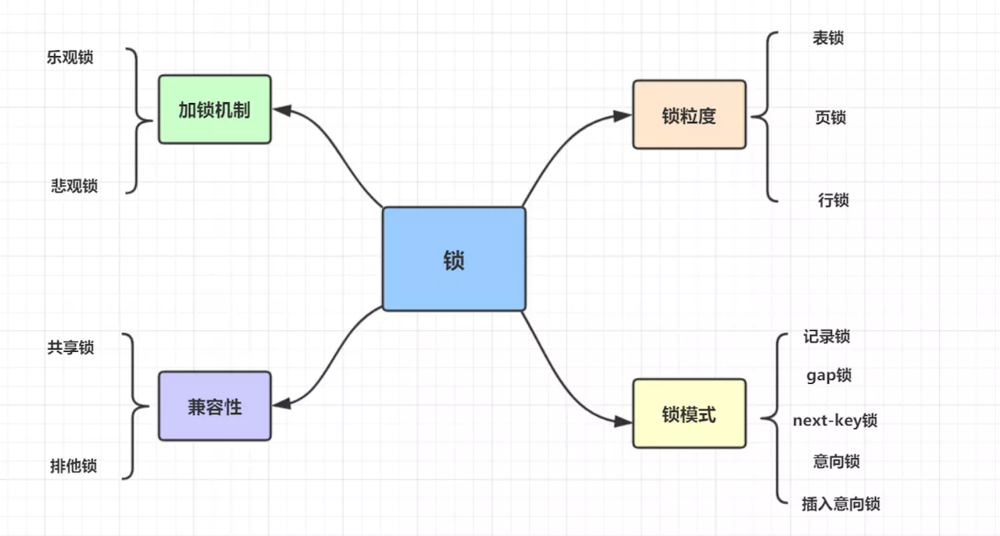
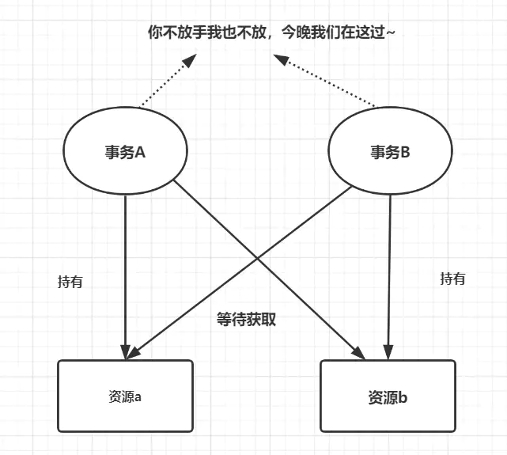

[事务理论基础](../theory/transaction.md)

## 事务 ACID 特性的实现

### 原子性

是使用 undo log 来实现的，如果事务执行过程中出错或者用户执行了 rollback，系统通过 undo log 返回事务开始的状态。

### 持久性

使用 redo log 来实现，只要 redo log 持久化了，当系统崩溃，即可通过 redo log 把数据恢复。

### 隔离性

通过锁以及 MVCC，使事务相互隔离开。

### 一致性

通过回滚、恢复，以及并发情况下的隔离性，从而实现一致性。

## SQL 加锁分析

一条 SQL 加锁，可以分 9 种情况进行：

RC 可提交读；RR 可重复读。

- 组合一：id 列是主键，RC 隔离级别
- 组合二：id 列是二级唯一索引，RC 隔离级别
- 组合三：id 列是二级非唯一索引，RC 隔离级别
- 组合四：id 列上没有索引，RC 隔离级别
- 组合五：id 列是主键，RR 隔离级别
- 组合六：id 列是二级唯一索引，RR 隔离级别
- 组合七：id 列是二级非唯一索引，RR 隔离级别
- 组合八：id 列上没有索引，RR 隔离级别
- 组合九：Serializable 隔离级别

## 隔离级别与锁的关系

依赖锁和 MVCC 实现的。

## 锁的种类



按锁粒度分有：表锁，页锁，行锁。

- 表锁： 开销小，加锁快；锁定力度大，发生锁冲突概率高，并发度最低;不会出现死锁。
- 行锁： 开销大，加锁慢；会出现死锁；锁定粒度小，发生锁冲突的概率低，并发度高。
- 页锁： 开销和加锁速度介于表锁和行锁之间；会出现死锁；锁定粒度介于表锁和行锁之间，并发度一般

按锁机制分有：乐观锁，悲观锁。

从锁的类别上来讲，有共享锁和排他锁。

- 共享锁: 又叫做读锁。当用户要进行数据的读取时，对数据加上共享锁。共享锁可以同时加上多个。
- 排他锁: 又叫做写锁。当用户要进行数据的写入时，对数据加上排他锁。排他锁只可以加一个，他和其他的排他锁，共享锁都相斥。

## 行锁实现原理

基于索引来完成行锁的。

## 死锁

死锁是指两个或多个事务在同一资源上相互占用，并请求锁定对方的资源，从而导致恶性循环的现象。



死锁有四个必要条件：互斥条件，请求和保持条件，环路等待条件，不剥夺条件。

解决死锁思路，一般就是切断环路，尽量避免并发形成环路。

- 如果不同程序会并发存取多个表，尽量约定以相同的顺序访问表，可以大大降低死锁机会。
- 在同一个事务中，尽可能做到一次锁定所需要的所有资源，减少死锁产生概率；
- 对于非常容易产生死锁的业务部分，可以尝试使用升级锁定颗粒度，通过表级锁定来减少死锁产生的概率；
- 如果业务处理不好可以用分布式事务锁或者使用乐观锁
- 死锁与索引密不可分，解决索引问题，需要合理优化索引，

```bash

```

```sql

```


## 二级

```bash

```

```sql

```

### 三级

```bash

```

```sql

```


## 二级

```bash

```

```sql

```

### 三级

```bash

```

```sql

```
