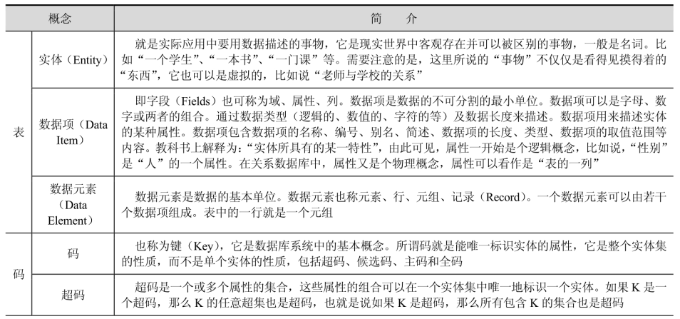
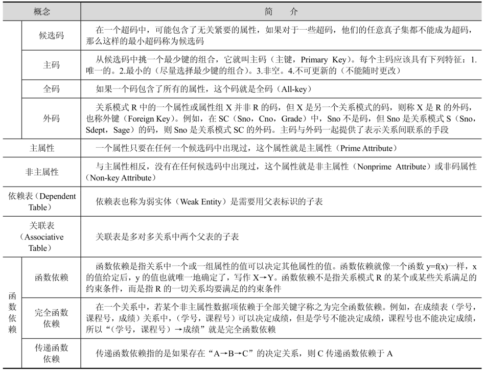

## 什么是范式？

为了设计出**合理的关系型数据库**，需要**遵从不同的规范要求**，这些不同的规范要求被称为不同的范式（Normal Form），越高的范式数据库冗余越小。

数据库范式的目的是为了**消除重复数据，减少数据冗余，更好地组织数据库内的数据，让磁盘空间得到更有效的利用。**

**范式使查询变得相当复杂**，在查询时需要更多的连接，**一些复合索引的列由于范式化的需要被分割到不同的表中，导致索引策略不佳**。

## 范式常用概念





## 什么是第一、二、三、BC 范式？

所谓“第几范式”，是表示关系的某一种级别，所以经常称某一关系 R 为第几范式。

目前关系型数据库有六种范式：第一范式（1NF）、第二范式（2NF）、第三范式（3NF）、巴斯-科德范式（BCNF）、第四范式（4NF）和第五范式（5NF，又称完美范式）。

满足最低要求的范式是第一范式（1NF）。在第一范式的基础上进一步满足更多规范要求的称为第二范式（2NF），其余范式以此类推。一般说来，**数据库只需满足第三范式（3NF）就行了**。

满足高等级的范式的先决条件是必须先满足低等级范式。

在关系数据库中，关系是通过表来表示的。在一个表中，每一行代表一个联系，而一个关系就是由许多的联系组成的集合。所以，在关系模型中，**关系用来指代表**，而**元组用来指代行**，**属性就是表中的列**。对于每一个属性，都存在一个允许取值的集合，称为该属性的域。

### 第一范式（1NF）：属性不可分

所谓第一范式（1NF）是指在关系模型中，对域添加的一个规范要求，**所有的域都应该是原子性的**，即**数据库表的每一列都是不可分割的原子数据项**，而不能是集合、数组、记录等非原子数据项。即当实体中的某个属性有多个值时，必须将其拆分为不同的属性。在符合第一范式（1NF）表中的每个域值只能是实体的一个属性或一个属性的一部分。简而言之，第一范式就是无重复的域。例如，由“职工号”、“姓名”、“电话号码”组成的职工表，由于一个人可能有一个办公电话和一个移动电话，所以，这时可以将其规范化为 1NF。将电话号码分为“办公电话”和“移动电话”两个属性，即职工表（职工号，姓名，办公电话，移动电话）。

需要注意的是，在任何一个关系型数据库中，**第一范式（1NF）是对关系模式的设计基本要求**，一般设计时都必须满足第一范式（1NF）。不过有些关系模型中突破了 1NF 的限制，这种称为非 1NF 的关系模型。换句话说，是否必须满足 1NF 的最低要求，主要依赖于所使用的关系模型。不满足 1NF 的数据库就不是关系数据库。**满足 1NF 的表必须要有主键且每个属性不可再分**。

### 第二范式（2NF）：非主属性完全依赖于码

在 1NF 的基础上，**每一个非主属性必须完全依赖于码**（在 1NF 基础上，**消除非主属性对主键的部分函数依赖**）。

第二范式（2NF）是在第一范式（1NF）的基础上建立起来的，即满足第二范式（2NF）必须先满足第一范式（1NF）。第二范式（2NF）要求数据库表中的**每个实例或记录必须可以被唯一地区分**。选取一个能区分每个实体的属性或属性组，作为实体的唯一标识。

例如，在选课关系表（学号，课程号，成绩，学分）中，码为组合关键字（学号，课程号）。但是，由于**非主属性学分仅仅依赖于课程号**，对关键字（学号，课程号）只是部分依赖，而不是完全依赖，所以，此种方式会导致数据冗余、更新异常、插入异常和删除异常等问题，其设计不符合 2NF。解决办法是将其分为两个关系模式：学生表（学号，课程号，分数）和课程表（课程号，学分），新关系通过学生表中的外键字课程号联系，在需要时通过两个表的连接来取出数据。

第二范式（2NF）要求**实体的属性完全依赖于主关键字**。所谓完全依赖是指**不能存在仅依赖主关键字一部分的属性**，如果存在，那么这个属性和主关键字的这一部分应该分离出来形成一个新的实体，新实体与原实体之间是一对多的关系。为实现区分通常需要为表加上一个列，以存储各个实例的唯一标识。

简而言之，**第二范式就是在第一范式的基础上属性完全依赖于主键**。

**所有单关键字的数据库表都符合第二范式**，因为不可能存在组合关键字。

### 第三范式（3NF）：消除依赖和传递依赖

在 1NF 基础上，每个非主属性既不**部分依赖**于码也不传递依赖于码（**在 2NF 基础上消除传递依赖**）。如果关系模式 R 是第二范式，且每个非主属性都不传递依赖于 R 的码，则称 R 是第三范式的模式。第三范式（3NF）是第二范式（2NF）的一个子集，即满足第三范式（3NF）前必须先满足第二范式（2NF）。

例如，学生表（学号，姓名，课程号，成绩），其中学生姓名若无重名，所以，该表有两个候选码（学号，课程号）和（姓名，课程号），则存在函数依赖：学号→姓名，（学号，课程号）→成绩，（姓名，课程号）→成绩，**唯一的非主属性成绩对码不存在部分依赖，也不存在传递依赖**，所以，属于第三范式。

满足第三范式的数据库表应该不存在如下依赖关系：

```
关键字段 → 非关键字段 x → 非关键字段 y
```

假定学生关系表为（学号，姓名，年龄，所在学院，学院地点，学院电话），关键字为单一关键字“学号”，因为存在如下决定关系：

```
（学号）→（姓名，年龄，所在学院，学院地点，学院电话）
```

这个关系是符合 2NF 的，但是不符合 3NF，因为存在如下决定关系：

```
（学号）→（所在学院）→（学院地点，学院电话）
```

即存在非关键字段“学院地点”、“学院电话”对关键字段“学号”的传递函数依赖。它也会存在数据冗余、更新异常、插入异常和删除异常的情况。把学生关系表分为如下两个表：

```
学生：（学号，姓名，年龄，所在学院）；

学院：（学院，地点，电话）。
```

这样的数据库表是符合第三范式的，**消除了数据冗余、更新异常、插入异常和删除异常**。

### 巴斯-科德范式 BCNF（Boyce-Codd Normal Form）

在 1NF 基础上，**任何非主属性不能对主键子集依赖**（在 3NF 基础上**消除对主键子集的依赖**）。

若关系模式 R 是第一范式，且每个属性（包括主属性）既不存在部分函数依赖也不存在传递函数依赖于 R 的候选键，这种关系模式就是 BCNF 模式。即在第三范式的基础上，数据库表中如果不存在任何字段对任一候选关键字段的传递函数依赖则符合 BCNF。BCNF 是修正的第三范式，有时也称扩充的第三范式。

BCNF 是第三范式（3NF）的一个子集，即满足 BCNF 必须满足第三范式（3NF）。通常情况下，BCNF 被认为没有新的设计规范加入，只是对第二范式与第三范式中设计规范要求更强，因而被认为是修正第三范式，也就是说，它事实上是对第三范式的修正，使数据库冗余度更小。这也是 BCNF 不被称为第四范式的原因。

对于 BCNF，在主键的任何一个真子集都不能决定于主属性。关系中 U 主键，若 U 中的任何一个真子集 X 都不能决定于主属性 Y，则该设计规范属性 BCNF。例如：在关系 R 中，U 为主键，A 属性是主键中的一个属性，若存在 A->Y，Y 为主属性，则该关系不属于 BCNF。

假设仓库管理关系表（仓库号，存储物品号，管理员号，数量），满足一个管理员只在一个仓库工作；一个仓库可以存储多种物品。则存在如下关系：

```
（仓库号，存储物品号）→（管理员号，数量）
（管理员号，存储物品号）→（仓库号，数量）
```

所以，（仓库号，存储物品号）和（管理员号，存储物品号）都是仓库管理关系表的候选码，表中的唯一非关键字段为数量，它是符合第三范式的。但是，由于存在如下决定关系：

```
（仓库号）→（管理员号）
（管理员号）→（仓库号）
```

**即存在关键字段决定关键字段的情况**，所以，其不符合 BCNF 范式。把仓库管理关系表分解为二个关系表：仓库管理表（仓库号，管理员号）和仓库表（仓库号，存储物品号，数量），这样的数据库表是符合 BCNF 范式的，消除了删除异常、插入异常和更新异常。

## 什么是反范式？

数据库设计要严格遵守范式，这样设计出来的数据库，虽然思路很清晰，结构也很合理，但是，有时候却要在一定程度上打破范式设计。因为**范式越高，设计出来的表可能越多，关系可能越复杂，但是性能却不一定会很好，因为表一多，就增加了关联性**，所以就引入了反范式。

**不满足范式的模型，就是反范式模型**。反范式跟范式所要求的正好相反，在反范式的设计模式中，**可以允许适当的数据冗余，用这个冗余可以缩短查询获取数据的时间**。反范式其**本质上就是用空间来换取时间，把数据冗余在多个表中，当查询时就可以减少或者避免表之间的关联**。

优点是减少了数据库查询时表之间的连接次数，可以更好地利用索引进行筛选和排序，从而减少了 I/O 数据量，提高了查询效率。

缺点是数据存在重复和冗余，存在部分空间浪费。另外，为了保持数据的一致性，则必须维护这部分冗余数据，因此增加了维护的复杂性。所以，在进行范式设计时，要在数据一致性与查询之间找到平衡点，因为符合业务场景的设计才是好的设计。

### 反范式技术

在关系型数据库模型设计过程中，常常使用范式来约束模型，但在 NoSQL 模型中则大量采用反范式。常见的数据库反范式技术包括：

- 增加冗余列：在多个表中保留相同的列，以减少表连接的次数。冗余法以空间换取时间，把数据冗余在多个表中，当查询时可以减少或者是避免表之间的关联。
- 增加派生列：表中增加可以由本表或其他表中数据计算生成的列，减少查询时的连接操作并避免计算或使用集合函数。
- 表水平分割：根据一列或多列的值将数据放到多个独立的表中，主要用于表的规模很大、表中数据相对独立或数据需要存放到多个介质的情况。
- 表垂直分割：对表按列进行分割，将主键和一部分列放到一个表中，主键与其他列放到另一个表中，在查询时减少 I/O 次数。

比如，有学生表与班级表，假定学生表要经常被查询，而且在查询中要显示班级名称，则查询语句需要连接两个表，这样就会增加查询的时间。现在，假定评估到班级改名或者换班级的需求是非常少的，那么，就可以把班级名称冗余到学生表中，即在学生表中增加一个班级名称的列。这里并没有省略班级表，只不过是把班级名称冗余在了课程表中，如果万一有很少的班级改名或者换班级需求，只要保证在学生表中改名正确即可。

## 对比

范式化模型，数据没有冗余，更新任意，但当表的数量比较多，查询设计需要很多关联模型时，会导致查询性能低下。

反范式化模型，数据冗余将带来很好的读取性能，不需要关联多个模型，但需要维护冗余数据，修改数据时必需保证数据的一致性。
