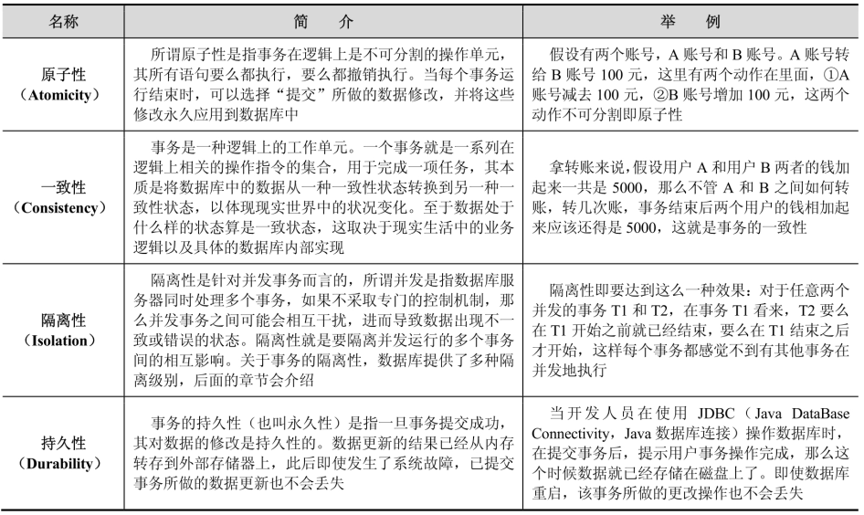
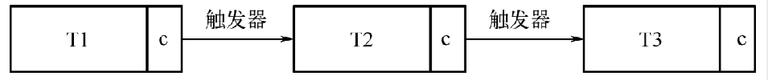
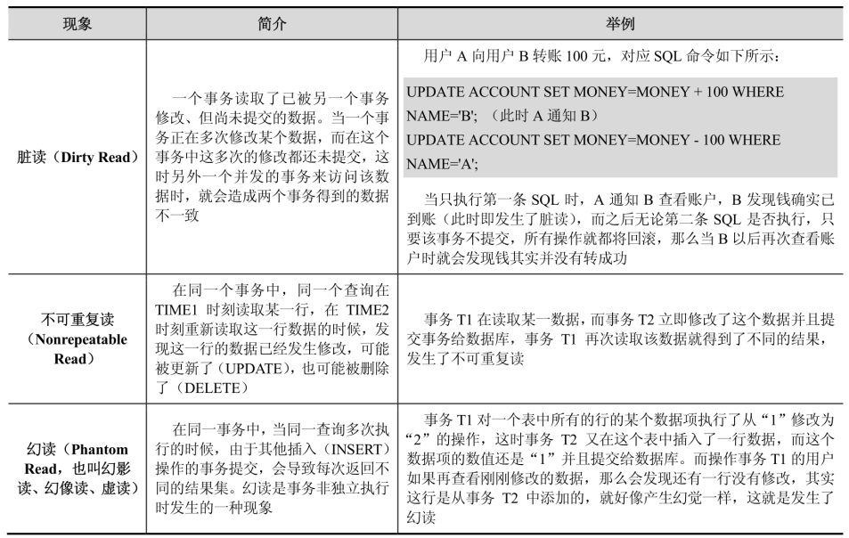
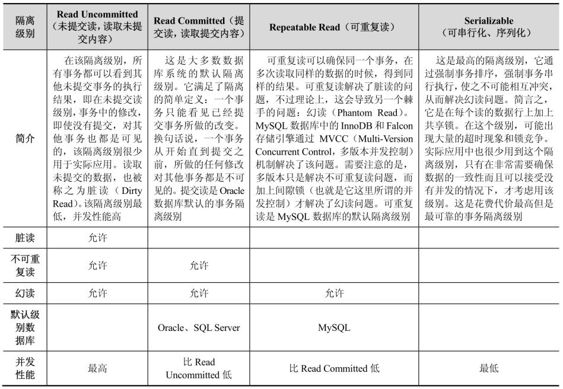

## 事务的概念及其4个特性

事务（Transaction）是一个操作序列，这些操作要么都执行成功，要么都不执行，是一个不可分割的工作单位。

事务通常以 `BEGIN TRANSACTION` 开始，以 `COMMIT` 或 `ROLLBACK` 操作结束，`COMMIT` 即提交，提交事务中所有的操作、事务正常结束。`ROLLBACK `即回滚，撤销已做的所有操作，回滚到事务开始时的状态。事务是数据库系统区别于文件系统的重要特性之一。

事务有 4 个特性，一般都称之为 ACID 特性，如下表所示：

- 原子性：事务是一个不可分割的工作单位，事务中的操作要么都执行成功，要么都不执行。
- 一致性：事务必须使数据库从一个一致性状态变换到另一个一致性状态。一致性的含义是数据库的完整性约束没有被破坏。
- 隔离性：隔离性是指一个事务的执行不能被其他事务干扰，多个并发事务之间要相互隔离。事务的隔离性是通过锁机制来实现的。
- 持久性：持久性是指一个事务一旦被提交，它对数据库中数据的改变就应该是永久性的。即使系统发生崩溃也不应该对其有任何影响。

## 事务的常见分类

### 扁平事务

在扁平事务中，所有操作都处于同一层次，其间的操作是原子的，要么都执行，要么都回滚，因此，扁平事务是应用程序成为原子操作的基本组成模块。扁平事务的主要限制是不能提交或者回滚事务的某一部分，或分几个步骤提交。

保存点（Savepoint）用来通知事务系统应该记住事务当前的状态，以便当之后发生错误时，事务能回到保存点当时的状态。对于扁平的事务来说，隐式的设置了一个保存点，然而在整个事务中，只有这一个保存点，因此，回滚只能会滚到事务开始时的状态。

扁平事务一般有三种不同的结果：

- 事务成功完成。
- 应用程序要求停止事务。比如应用程序在捕获到异常时会回滚事务。
- 外界因素强制终止事务。如连接超时或连接断开。

### 带有保存点的扁平事务

除了支持扁平事务支持的操作外，还允许在事务执行过程中回滚到同一事务中较早的一个状态。这是因为某些事务可能在执行过程中出现的错误并不会导致所有的操作都无效，放弃整个事务不合乎要求，开销太大。

### 链事务

是指**一个事务由多个子事务链式组成**，它可以被视为保存点模式的一个变种。

带有保存点的扁平事务，当发生系统崩溃时，所有的保存点都将消失，这意味着当进行恢复时，事务需要从开始处重新执行，而不能从最近的一个保存点继续执行。

链事务在提交一个事务时，释放不需要的数据对象，将必要的处理上下文隐式地传给下一个要开始的事务，前一个子事务的提交操作和下一个子事务的开始操作合并成一个原子操作，这意味着下一个事务将看到上一个事务的结果，就好像在一个事务中进行一样。这样，在提交子事务时就可以释放不需要的数据对象，而不必等到整个事务完成后才释放。

链事务与带有保存点的扁平事务的不同之处体现在：

- 带有保存点的扁平事务能回滚到任意正确的保存点，而**链事务中的回滚仅限于当前事务**，即只能恢复到最近的一个保存点。
- 对于锁的处理，两者也不相同，链事务在执行 COMMIT 后即释放了当前所持有的锁，而带有保存点的扁平事务不影响迄今为止所持有的锁。

### 嵌套事务

是一个层次结构框架，由一个顶层事务（Top-Level Transaction）控制着各个层次的事务，顶层事务之下嵌套的事务被称为子事务（Subtransaction），其控制着每一个局部的变换，子事务本身也可以是嵌套事务。因此，嵌套事务的层次结构可以看成是一棵树。

### 分布式事务

通常是在一个分布式环境下运行的扁平事务，因此，需要根据数据所在位置访问网络中不同节点的数据库资源。例如，一个银行用户从招商银行的账户向工商银行的账户转账 1000 元，这里需要用到分布式事务，因为不能仅调用某一家银行的数据库就完成任务。

### XA 事务

XA（eXtended Architecture）是指由 X/Open 组织提出的分布式交易处理的规范。XA 是一个分布式事务协议，由 Tuxedo 提出，所以，分布式事务也称为 XA 事务。XA 协议主要定义了事务管理器（TM，Transaction Manager，协调者）和资源管理器（RM，Resource Manager，参与者）之间的接口。其中，资源管理器往往由数据库实现，例如 Oracle、DB2、MySQL，这些商业数据库都实现了 XA 接口，而事务管理器作为全局的调度者，负责各个本地资源的提交和回滚。XA 事务是基于两阶段提交（Two-phase Commit，2PC）协议实现的，可以保证数据的强一致性，许多分布式关系型数据管理系统都采用此协议来完成分布式。阶段一为准备阶段，即所有的参与者准备执行事务并锁住需要的资源。当参与者 Ready 时，向 TM 汇报自己已经准备好。阶段二为提交阶段。当 TM 确认所有参与者都 Ready 后，向所有参与者发送 COMMIT 命令。

XA 事务允许不同数据库的分布式事务，只要参与在全局事务中的每个节点都支持 XA 事务。Oracle、MySQL和 SQL Server 都支持 XA 事务。

- XA 事务由一个或多个资源管理器（RM）、一个事务管理器（TM）以及一个应用程序（Application Program）组成。
- 资源管理器：提供访问事务资源的方法。通常一个数据库就是一个资源管理器。
- 事务管理器：协调参与全局事务中的各个事务。需要和参与全局事务的所有资源管理器进行通信。
- 应用程序：定义事务的边界。

XA 事务的缺点是性能不佳，且 XA 无法满足高并发场景。一个数据库的事务和多个数据库间的 XA 事务性能会相差很多。因此，要尽量避免使用 XA 事务，例如可以将数据写入本地，用高性能的消息系统分发数据，或使用数据库复制等技术。只有在其他办法都无法实现业务需求，且性能不是瓶颈时才使用 XA。

## 事务的 4 种隔离级别（Isolation Level）

当多个线程都开启事务操作数据库中的数据时，数据库系统要能进行隔离操作，以保证各个线程获取数据的准确性，所以，对于不同的事务，采用不同的隔离级别会有不同的结果。

如果不考虑事务的隔离性，那么会发生下表所示的 3 种问题：

**脏读和不可重复读的区别**为：脏读是某一事务读取了另一个事务未提交的脏数据，而不可重复读则是在同一个事务范围内多次查询同一条数据却返回了不同的数据值，这是由于在查询间隔期间，该条数据被另一个事务修改并提交了。

**幻读和不可重复读的区别**为：幻读和不可重复读都是读取了另一个事务中已经提交的数据，不同的是**不可重复读查询的都是同一个数据项**，而**幻读针对的是一个数据整体**（例如数据的条数）。

在 SQL 标准中定义了 4 种隔离级别，每一种级别都规定了一个事务中所做的修改，哪些是在事务内和事务间可见的，哪些是不可见的。较低级别的隔离通常可以执行更高的并发，系统的开销也更低。SQL 标准定义的四个隔离级别为：`Read Uncommitted`（未提交读）、`Read Committed`（提交读）、`Repeatable Read`（可重复读）、`Serializable`（可串行化）。

### Read Uncommitted（未提交读，读取未提交内容）

在该隔离级别，所有事务都可以看到其他未提交事务的执行结果，即在未提交读级别，事务中的修改，即使没有提交，对其他事务也都是可见的，该隔离级别很少用于实际应用。读取未提交的数据，也被称之为脏读（Dirty Read）。该隔离级别最低，并发性能最高。

### Read Committed（提交读，读取提交内容）

这是大多数数据库系统的默认隔离级别。它满足了隔离的简单定义：一个事务只能看见已经提交事务所做的改变。换句话说，一个事务从开始直到提交之前，所做的任何修改对其他事务都是不可见的。

### Repeatable Read（可重复读）

可重复读可以确保同一个事务，在多次读取同样数据的时候，得到同样的结果。可重复读解决了脏读的问题，不过理论上，这会导致另一个棘手的问题：幻读（Phantom Read）。MySQL数据库中的InnoDB和Falcon存储引擎通过MVCC（Multi-Version Concurrent Control，多版本并发控制）机制解决了该问题。需要注意的是，多版本只是解决不可重复读问题，而加上间隙锁（也就是它这里所谓的并发控制）才解决了幻读问题。

### Serializable（可串行化、序列化）

这是最高的隔离级别，它通过强制事务排序，强制事务串行执行，使之不可能相互冲突，从而解决幻读问题。简言之，它是在每个读的数据行上加上共享锁。在这个级别，可能出现大量的超时现象和锁竞争。实际应用中也很少用到这个隔离级别，只有在非常需要确保数据的一致性而且可以接受没有并发的情况下，才考虑用该级别。这是花费代价最高但是最可靠的事务隔离级别。

不同的隔离级别有不同的现象，并有不同的锁和并发机制，隔离级别越高，数据库的并发性能就越差。

## MySQL 中的事务隔离级别

MySQL 数据库支持 Read Uncommitted（未提交读）、Read Committed（提交读）、Repeatable Read（可重复读）和 Serializable（可串行化）这 4 种事务隔离级别，其中，Repeatable Read（可重复读）是 MySQL 数据库的默认隔离级别。

## CAP 定理（CAP theorem）

CAP 定理又称 CAP 原则是一个衡量系统设计的准则。

CAP 定理指的是在一个分布式系统中，Consistency（一致性）、Availability（可用性）、Partition Tolerance（分区容错性），三者不可兼得。

- C（一致性）：所有节点在同一时间的数据完全一致；
- A（可用性）：服务一直可用，每个请求都能接收到一个响应，无论响应成功或失败；
- P（分区容错性）：分布式系统在遇到某节点或网络分区故障的时候，仍然能够对外提供满足一致性和可用性的服务。

任何分布式系统在可用性、一致性、分区容错性方面，不能兼得，最多只能得其二。因此，任何分布式系统的设计只是在三者中的不同取舍而已。所以，就有了 3 个分类：CA 数据库，CP 数据库和 AP 数据库。传统的关系型数据库在功能支持上通常很宽泛，从简单的键值查询，到复杂得多表联合查询再到事务机制的支持。而与之不同的是，NoSQL 系统通常注重性能和扩展性，而非事务机制，因为事务就是强一致性的体现。

CP 数据库考虑的是一致性和分区容错性，这种数据库对分布式系统内的通信要求比较高，因为要保持数据的一致性，需要做大量的交互。CP 数据库通常性能不是特别高，例如火车售票系统。

AP 数据库考虑的是实用性和分区容忍性，即外部访问数据，可以更快地得到回应，例如博客系统。这时候，数据的一致性就可能得不到满足或者对一致性要求低一些，各节点之间的数据同步没有那么快，但能保存数据的最终一致性。比如一个数据，可能外部一个进程在改写这个数据，同时另一个进程在读这个数据，此时，数据显现是不一致的。但是有一点，就是数据库会满足一个最终一致性的概念，即过程可能是不一致的，但是到某一个终点，数据就会一致起来。当前热炒的 NoSQL 大多是典型的 AP 类型数据库。

### CAP 和 ACID 一致性的区别

事务 ACID 中的一致性是有关数据库规则的描述，如果**数据表结构定义一个字段值是唯一的**，那么**一致性系统将解决所有操作中导致这个字段值非唯一性的情况，如果带有一个外键的一行记录被删除，那么其外键相关记录也应该被删除**，这就是 ACID 一致性意思。

CAP 理论的一致性是**保证同一个数据在所有不同服务器上的拷贝都是相同的**，这是一种逻辑保证，而不是物理，因为网络速度限制，在不同服务器上这种复制是需要时间的，集群通过阻止客户端查看不同节点上还未同步的数据维持逻辑视图。
