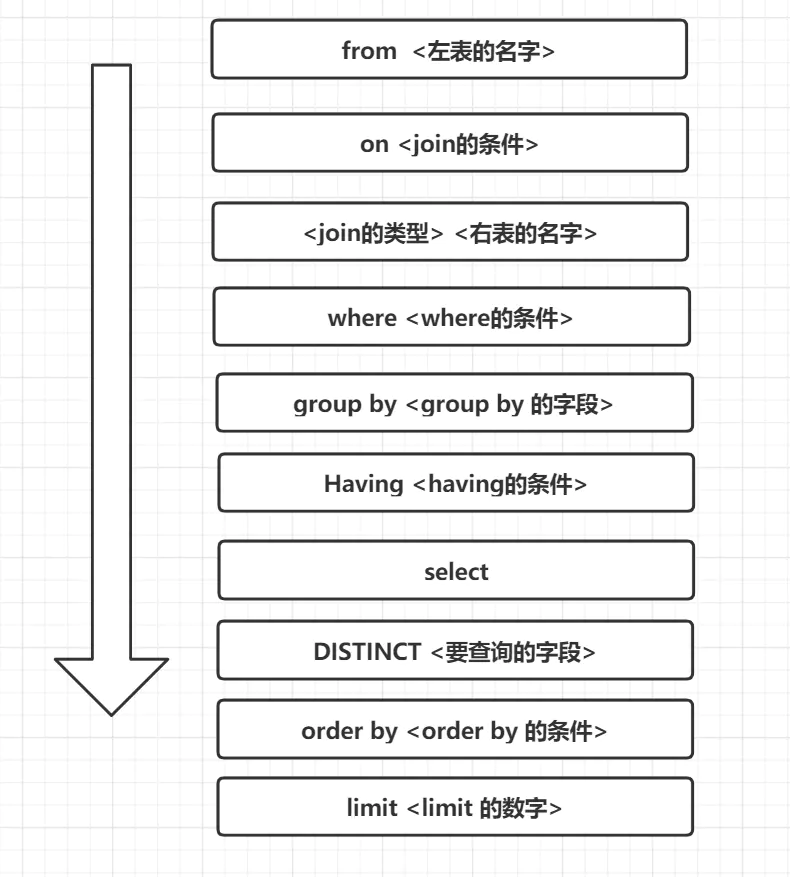

## 如何删除百万级别或以上的数据

- 先删除索引
- 然后批量删除数据
- 删除完成后重新创建索引

## count(1)、count(*) 与 count(列名) 的区别？

- count(*) 包括了所有的列，相当于行数，在统计结果的时候，不会忽略列值为 NULL
- count(1) 包括了忽略所有列，用 1 代表代码行，在统计结果的时候，不会忽略列值为 NULL
- count(列名) 只包括列名那一列，在统计结果的时候，会忽略列值为空（这里的空不是只空字符串或者 0，而是表示 null）的计数，即某个字段值为 NULL 时，不统计。

## SQL 约束有哪几种呢？

- NOT NULL: 约束字段的内容一定不能为 NULL。
- UNIQUE: 约束字段唯一性，一个表允许有多个 Unique 约束。
- PRIMARY KEY: 约束字段唯一，不可重复，一个表只允许存在一个。
- FOREIGN KEY: 用于预防破坏表之间连接的动作，也能防止非法数据插入外键。
- CHECK: 用于控制字段的值范围。

## 关联查询

- 交叉连接，使用 CROSS JOIN 关键字，返回两个表中所有的行的组合。
- 内连接，使用 INNER JOIN 关键字，返回两个表中满足条件的行的组合。
- 外连接，使用 LEFT JOIN 或 RIGHT JOIN 关键字，返回两个表中满足条件的行的组合，如果某个表中的行在另一个表中没有匹配的行，则用 NULL 值填充。
- 联合查询，使用 UNION 关键字，返回两个表中满足条件的行的组合，但是不会返回重复的行。
- 全连接，使用 FULL JOIN 关键字，返回两个表中满足条件的行的组合，如果某个表中的行在另一个表中没有匹配的行，则用 NULL 值填充。

## SQL 的生命周期

- 服务器与数据库建立连接
- 数据库进程拿到请求 SQL
- 解析并生成执行计划，执行
- 读取数据到内存，并进行逻辑处理
- 通过步骤一的连接，发送结果到客户端
- 关掉连接，释放资源

## 一条 SQL 的执行顺序



## 自增主键用完会怎么样？

自增主键一般用 int 类型，一般达不到最大值，可以考虑提前分库分表的。

自增 ID 用完后，一直都是最大值，如果标识了主键，则主键冲突。

## 一个 6 亿的表 users，一个 3 亿的表 posts，通过外键 user_id 关联，你如何最快的查询出满足条件的第 50000 到第 50200 中的这 200 条数据记录。

如果 posts 表 user_id 是自增长，并且是连续的，users 表的 id 为索引

```sql
SELECT *
FROM users,
     posts
WHERE users.id = posts.user_id
  AND  posts.user_id> 50000
limit 200;
```

如果 posts 表 user_id 不是连续的，那么就需要使用覆盖索引。user_id 要么是主键，要么是辅助索引，users 表的 id 为索引。

```sql
SELECT *
FROM users,
     (SELECT user_id
      FROM posts
      LIMIT 50000,200) AS p
WHERE users.id = p.user_id;
```
